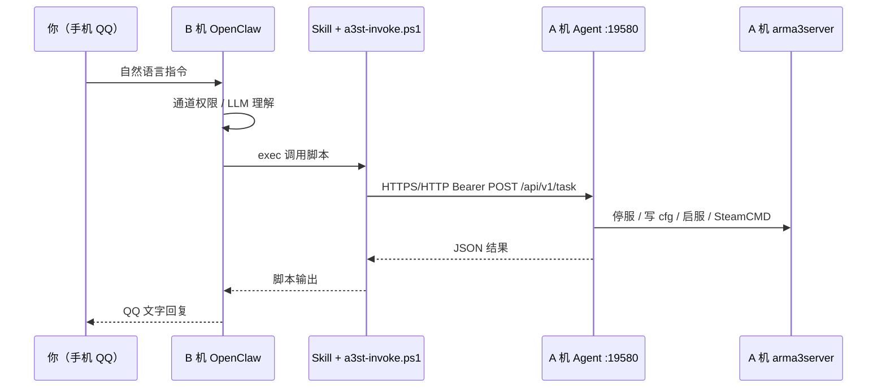

# 双机部署：A 开服 · B OpenClaw（QQ 接在 B）

本文是 **生产向分步手册**：在 **A 机**跑 Arma 3 专用服与 Agent，在 **B 机**跑 OpenClaw（QQ 等 IM 接在 B），用手机 QQ 远程操控开服工具。  
**A 与 B 不必在同一局域网**；跨地域、动态宽带时按 **[§3 网络场景选型](#3-网络场景选型内网--公网)** 用 Tailscale 或 HTTPS 公网互通（**首选 Tailscale**，避免裸奔 `19580`）。

**相关文档（按需跳转）**

| 文档 | 内容 |
|------|------|
| [openclaw-integration.md](openclaw-integration.md) | OpenClaw 与同机 `127.0.0.1` 集成 |
| [agent-channels.md](agent-channels.md) | HTTP API、任务 JSON、`action` 列表 |
| [agent-capabilities.md](agent-capabilities.md) | 各 action 在磁盘/进程上的行为与限制 |
| [skills/arma3-server-tools/SKILL.md](../skills/arma3-server-tools/SKILL.md) | OpenClaw Skill 说明 |
| [first-server-guide.md](first-server-guide.md) | A 机首次用 WinForms 建服 |

---

## 目录

1. [拓扑与职责](#1-拓扑与职责)
2. [部署前检查清单](#2-部署前检查清单)
3. [网络场景选型（内网 / 公网）](#3-网络场景选型内网--公网)
4. [A 机：安装与开服准备](#4-a-机安装与开服准备)
5. [A 机：Agent 配置详解](#5-a-机agent-配置详解)
6. [A 机：防火墙、urlacl、常驻](#6-a-机防火墙urlacl常驻)
7. [A 机：验收（不经过 QQ）](#7-a-机验收不经过-qq)
8. [B 机：OpenClaw + QQ + Skill](#8-b-机openclaw--qq--skill)
9. [B 机：连通性与脚本自测](#9-b-机连通性与脚本自测)
10. [端到端：QQ 对话验收](#10-端到端qq-对话验收)
11. [路径与数据目录（易踩坑）](#11-路径与数据目录易踩坑)
12. [安全与权限分层](#12-安全与权限分层)
13. [运维：更新、改 Token、多服](#13-运维更新改-token多服)
14. [故障排查](#14-故障排查)
15. [与同机部署对比](#15-与同机部署对比)

---

## 1. 拓扑与职责

推荐拓扑：**两台 Windows 服务器** + 你的手机 QQ（**没有第三台「C 机」**）。

| 节点 | 角色 | 典型进程 / 组件 |
|------|------|-----------------|
| **A 机** | 开服机 | `arma3server.exe`、WinForms（可选）、`Arma3ServerTools.Agent.Host`、SteamCMD |
| **B 机** | 自动化网关 | OpenClaw Gateway、QQ 协议栈（NapCat / go-cqhttp / 官方 Bot 等）、LLM、本仓库 Skill |
| **你的 QQ** | 操控入口 | 私聊/群聊 **B 上的机器人**；流量不经过 A 的 QQ 协议 |



**设计原则**

- **IM 只在 B**：本仓库 **不在 A 上**接 OneBot/QQ；避免与 OpenClaw 重复维护通道。
- **执行只在 A**：所有改 cfg、启停、SteamCMD 与 WinForms 共用同一套 Application 逻辑。
- **B→A 走 HTTP API**：端口默认 **19580**；A、B **可以不在同一局域网**，通过 **虚拟组网（推荐）** 或 **受控公网暴露** 互通（见 [§3](#3-网络场景选型内网--公网)）。

```text
你（手机 QQ）
  → QQ 协议 → B 机 OpenClaw（收消息、LLM、权限、回复）
      → 虚拟内网 / 公网 HTTPS → A 机 Agent :19580
          → A 本机 arma3server / cfg / SteamCMD
```

---

## 2. 部署前检查清单

在动手前确认：

### A 机（开服）

- [ ] Windows x64，能安装 **Arma3 Server Tools** 官方安装包（或自构建 `artifacts/_publish`）。
- [ ] 已用 WinForms **至少创建并保存过一台服务器配置**（见 [first-server-guide.md](first-server-guide.md)）。
- [ ] 安装路径 **不含中文**（工具启动时会检测）。
- [ ] SteamCMD、专用服路径、RCon 等已在 GUI 配好（自动化不会替你点每个设置页）。
- [ ] 已选定 **B→A 连通方式**（[§3](#3-网络场景选型内网--公网)：Tailscale / 反向隧道 / 公网端口映射 之一）。
- [ ] 知道 B 访问 A 时使用的 **URL**（内网 IP、Tailscale `100.x`、或 `https://域名`）。

### B 机（OpenClaw）

- [ ] OpenClaw Gateway **已能正常收发电报/QQ**（与本项目无关的部分先调通）。
- [ ] 已配置 **谁可以跟机器人说话**（QQ 号白名单、群策略等）。
- [ ] PowerShell 可用，`exec` 工具未被禁用。
- [ ] 从 B 能访问 A 的 Agent 地址（`Test-NetConnection` 或 `Invoke-RestMethod .../health`）。

### 密钥与网络

- [ ] 已生成 **足够长的 `apiToken`**（公网场景建议 ≥32 字符随机；首次启动 Agent 会自动生成）。
- [ ] 明确：**`allowedCallerIps` 是 B 访问 A 时 Agent 看到的源 IP**（不是 QQ 用户手机 IP）。
- [ ] 若 B 出口 IP **经常变化**（家庭宽带、云手机、多地部署）：不要依赖固定 `allowedCallerIps`，改用 **Tailscale** 或 **留空 IP 白名单 + 极强 Token + HTTPS**（见 §3.3）。

---

## 3. 网络场景选型（内网 / 公网）

A（开服）与 B（OpenClaw）**常常不在同一局域网** 时，仍可按本文部署；关键是选好 **B 如何稳定、安全地连到 A 的 Agent**。

Agent 本身只提供 **HTTP**（`HttpListener`），**不内置 TLS**。公网若需 HTTPS，请在 A 前加 **Caddy / Nginx** 反向代理，或使用带 HTTPS 的隧道产品。

### 3.1 方案对比（怎么选）

| 方案 | B 的 `A3ST_AGENT_URL` | A 上 `allowedCallerIps` | 暴露公网 19580 | 适用 |
|------|------------------------|-------------------------|----------------|------|
| **A. Tailscale / ZeroTier**（**首选**） | `http://100.x.x.x:19580`（A 的虚拟网 IP） | B 的虚拟网 IP（固定） | **否** | A/B 各地、动态宽带、云主机混杂 |
| **B. 反向隧道**（Cloudflare Tunnel、frp） | 隧道给的 `https://xxx` | 通常 `[]` | 经隧道，不直接映射 19580 | A 无公网 IP、不想开端口 |
| **C. A 公网 IP / 域名 + 端口映射** | `https://域名` 或 `http://公网IP:19580` | 常 **`[]`**（B 出口 IP 会变） | **是** | 有固定公网 IP/域名，能加固 |
| **D. 同一局域网** | `http://192.168.x.x:19580` | B 内网 IP | 仅内网 | 同机房/同一路由 |

**不推荐**：无隧道、无 VPN 时，把 `http://公网IP:19580` 裸奔且 Token 偏弱。

示例配置（安装包 `agent/` 目录）：

- 局域网：`agent-settings.example.json`
- Tailscale：`agent-settings.example.tailscale.json`
- 公网直连 + 空 IP 白名单：`agent-settings.example.public-internet.json`

### 3.2 方案 A：Tailscale / ZeroTier（推荐）

两台机安装 [Tailscale](https://tailscale.com/)（或 ZeroTier），同一账号/Network。B 通过 **虚拟内网 IP** 访问 A，与是否在同一城市无关。

| 名称 | 示例 | 说明 |
|------|------|------|
| A Tailscale IP | `100.64.0.10` | `tailscale ip` 或管理后台查看 |
| B Tailscale IP | `100.64.0.20` | 写入 A 的 `allowedCallerIps` |
| `A3ST_AGENT_URL`（B） | `http://100.64.0.10:19580` | 不用 QQ 用户手机 IP |

**A 机 `settings.json`**（完整见 `agent-settings.example.tailscale.json`）：

```json
{
  "http": {
    "remoteAccessEnabled": true,
    "listenHost": "+",
    "listenPort": 19580,
    "publicBaseUrl": "http://100.64.0.10:19580",
    "apiToken": "长随机串",
    "allowedCallerIps": ["100.64.0.20"]
  }
}
```

**防火墙**：可仅允许 Tailscale 网段访问 19580；**无需** 路由器映射 19580 到公网。

**验收（B 机）**：

```powershell
Test-NetConnection -ComputerName 100.64.0.10 -Port 19580
$env:A3ST_AGENT_URL = "http://100.64.0.10:19580"
Invoke-RestMethod -Uri "$env:A3ST_AGENT_URL/api/v1/health"
```

### 3.3 方案 B：反向隧道（A 无公网 IP）

在 **A** 运行隧道客户端，将 `127.0.0.1:19580` 暴露为 **HTTPS 公网 URL**（见 Cloudflare Tunnel、frp、ngrok 等产品文档）。

- B 的 `A3ST_AGENT_URL` = 隧道 URL（如 `https://a3st.example.com`）。
- `allowedCallerIps` 可 `[]`；鉴权靠 **`apiToken`**。
- 隧道地址勿发到公开群聊。

### 3.4 方案 C：A 公网 IP / 域名 + 端口映射（B 出口 IP 不固定）

A 有固定公网 IP 或域名；B 在多地/动态宽带，**无法** 固定 `allowedCallerIps`：

1. `remoteAccessEnabled`: `true`
2. `allowedCallerIps`: **`[]`**（不校验源 IP，**仅依赖强 `apiToken`**）
3. `apiToken`: ≥32 字符随机，仅 B 环境变量保存
4. **建议** HTTPS 反代（§3.5），避免 Token 明文走公网

```json
{
  "http": {
    "remoteAccessEnabled": true,
    "listenHost": "+",
    "listenPort": 19580,
    "publicBaseUrl": "https://a3st.example.com",
    "apiToken": "仅运维保存",
    "allowedCallerIps": []
  }
}
```

路由器/云安全组：TCP **19580**（或 **443** 若反代）指向 A。开放端口后会有扫描流量，务必强 Token + HTTPS。

### 3.5 公网 HTTPS 反向代理（Caddy 示例）

```text
a3st.example.com {
    reverse_proxy 127.0.0.1:19580
}
```

B：`A3ST_AGENT_URL` = `https://a3st.example.com`。Agent 仍监听本机 `19580`。

### 3.6 同一局域网（可选）

| 名称 | 示例值 |
|------|--------|
| A 内网 IP | `192.168.1.10` |
| B 内网 IP | `192.168.1.20` → `allowedCallerIps` |

B→A：TCP 19580；**不必** 映射 19580 到公网。

### 3.7 明确不需要的事

- 在 A 上装 QQ 机器人。
- 把 **QQ 用户手机公网 IP** 写入 `allowedCallerIps`。

---

## 4. A 机：安装与开服准备

### 4.1 安装主程序（含 Agent）

使用 **`Arma3ServerTools-Setup.exe`**（由 `scripts/build-release.ps1` 生成）安装到例如：

`C:\Program Files\Arma3 Server Tools\`

安装后目录结构（节选）：

```text
C:\Program Files\Arma3 Server Tools\
  Arma3ServerTools.exe              ← WinForms 主程序
  monitoring\
    Arma3ServerTools.MonitoringHost.exe
  agent\
    Arma3ServerTools.Agent.Host.exe
    agent-settings.example.json
    agent-settings.example.tailscale.json
    agent-settings.example.public-internet.json
                                    ← 示例；实际配置在 UserData，见 §5
  skills\arma3-server-tools\        ← 可给 B 机复制 Skill 用
  scripts\openclaw\
    a3st-invoke.ps1                 ← B 机 exec 调用
```

安装程序可选：

- **「登录 Windows 时自动启动 Agent」** → 创建计划任务 `Arma3 Server Tools Agent`，执行上述 `agent\Arma3ServerTools.Agent.Host.exe`。

### 4.2 用 WinForms 完成「第一台服」

1. 启动 `Arma3ServerTools.exe`。
2. 按 [first-server-guide.md](first-server-guide.md) 创建服务器、路径、端口、模组目录等。
3. **保存配置**；建议手动 **启动/停止一次**，确认本机开服流程正常。

> Agent 与 GUI **共用同一套** `a3st_serverconfig\` 与服务器 JSON；若从未在 GUI 建服，Agent 的 `list` 会是空的。

### 4.3 首次启动 Agent（生成配置与 Token）

在 **管理员 PowerShell** 中（路径按实际安装目录修改）：

```powershell
& "C:\Program Files\Arma3 Server Tools\agent\Arma3ServerTools.Agent.Host.exe"
```

首次运行会在 **用户数据目录** 创建 `config/agent/settings.json`（见 [§11 路径](#11-路径与数据目录易踩坑)）。

控制台会打印 **Settings 路径** 与 **public URL**；记下：

- `settings.json` 的完整路径  
- 其中的 `http.apiToken`（首次随机生成）

按 `Ctrl+C` 可先退出，改完配置再常驻运行。

---

## 5. A 机：Agent 配置详解

配置文件：`{UserData}/config/agent/settings.json`  
（**不是** `agent\agent-settings.example.json`）

### 5.1 配置示例（按网络场景选）

| 场景 | 复制模板 |
|------|----------|
| 同一局域网 | `agent-settings.example.json` |
| Tailscale / ZeroTier（**公网互通首选**） | `agent-settings.example.tailscale.json` |
| A 公网暴露、B 出口 IP 不固定 | `agent-settings.example.public-internet.json` |

复制到 `{UserData}/config/agent/settings.json` 后改 IP、Token。  
**B 的 `A3ST_AGENT_URL` 必须与 `publicBaseUrl` 一致**（含 `http`/`https`、端口）。

局域网示例：

```json
{
  "http": {
    "enabled": true,
    "remoteAccessEnabled": true,
    "listenHost": "+",
    "listenPort": 19580,
    "publicBaseUrl": "http://192.168.1.10:19580",
    "apiToken": "请替换为长随机串并与 B 机 OpenClaw 环境变量一致",
    "allowedCallerIps": ["192.168.1.20"]
  },
  "inbox": { "enabled": true, "pollSeconds": 5 }
}
```

### 5.2 字段说明（`http`）

| 字段 | 类型 | 双机建议 | 说明 |
|------|------|----------|------|
| `enabled` | bool | `true` | 关闭则不开 HTTP 监听 |
| `remoteAccessEnabled` | bool | **`true`** | `false` 时 **非本机** IP 一律 403；B 机必须 `true` |
| `listenHost` | string | `+` 或 A 的内网 IP | `127.0.0.1` 仅本机；`+` 表示所有网卡（需 urlacl，见 §6） |
| `listenPort` | int | `19580` | 与防火墙、`A3ST_AGENT_URL` 一致 |
| `listenPrefix` | string | 一般留空 | 若填写则 **覆盖** `listenHost`+`listenPort`，如 `http://192.168.1.10:19580/` |
| `publicBaseUrl` | string | 与 B 实际访问一致 | Tailscale：`http://100.x:19580`；HTTPS 反代：`https://域名`；**B 的 `A3ST_AGENT_URL` 与此一致** |
| `apiToken` | string | 长随机 | 为空则 **不校验** Token（仅本机调试）；公网场景 **必须** 设置强 Token |
| `allowedCallerIps` | string[] | 见 §3 | 非空：仅列出的源 IP；**`[]` + 远程开启 = 不校验 IP，只靠 Token**（B 出口 IP 常变时用，须配合 HTTPS） |

### 5.3 字段说明（`inbox`）

| 字段 | 说明 |
|------|------|
| `enabled` | 是否轮询 `{UserData}/config/agent/inbox/*.json` |
| `pollSeconds` | 轮询间隔；执行后文件移到 `inbox/processed/` 或 `inbox/failed/` |

OpenClaw 一般走 HTTP；Inbox 适合长任务编排或手工丢 JSON。

### 5.4 鉴权与 IP 校验顺序（便于排错）

对每一个 HTTP 请求：

1. **IP 白名单**（`AgentCallerAllowlist`）  
   - 本机回环地址（`127.0.0.1` / `::1`）**始终允许**。  
   - 非本机：若 `remoteAccessEnabled=false` → **403**。  
   - 若 `remoteAccessEnabled=true` 且 `allowedCallerIps` 非空 → 源 IP 必须在列表中。  
   - 若 `allowedCallerIps` **为空** 且远程已开启 → **任意 IP 可连**，仅 `apiToken` 挡未授权（公网动态 B 时用，见 §3.4）。  
2. **`/api/v1/health`** → 无需 Token。  
3. 其余 API → `Authorization: Bearer <apiToken>` 或查询参数 `?token=`（脚本 `health` 用 GET 时可带 query token）。

### 5.5 修改配置后

编辑 `settings.json` 后 **重启 Agent** 才会生效（当前版本不热重载）。

---

## 6. A 机：防火墙、urlacl、常驻

### 6.1 URL ACL（`listenHost` 为 `+` 时）

HttpListener 绑定 `http://+:19580/` 需要预留 URL（**管理员 PowerShell**）：

```powershell
netsh http add urlacl url=http://+:19580/ user=Everyone
```

若已存在会提示冲突，可 `netsh http show urlacl` 查看。

仅绑定单 IP 时可改为：

```json
"listenHost": "192.168.1.10"
```

并相应调整 urlacl 为 `http://192.168.1.10:19580/`。

### 6.2 Windows 防火墙（按 §3 方案）

**Tailscale / 内网（推荐）** — 仅允许 B 的固定 IP（虚拟网或内网）：

```powershell
New-NetFirewallRule -DisplayName "A3ST Agent (OpenClaw B only)" `
  -Direction Inbound -Protocol TCP -LocalPort 19580 `
  -RemoteAddress 100.64.0.20 -Action Allow
```

将 `100.64.0.20` 换成 B 的 Tailscale IP 或 `192.168.1.20`。

**公网端口映射（§3.4）** — 路由器/云安全组放行 19580（或 443）到 A；Windows 防火墙可对入站 19580 放行（源为 Any）。此时 **必须** 强 `apiToken` + 建议 HTTPS，不能单靠 IP 白名单。

云主机 **安全组**：若用 Tailscale，可不对公网开放 19580；若用公网直连，只开放必要端口。

### 6.3 常驻方式（三选一）

| 方式 | 适用 |
|------|------|
| 安装包勾选「登录时自动启动 Agent」 | 最省事；计划任务名 `Arma3 Server Tools Agent` |
| 任务计划程序 | 可改为 SYSTEM / 指定用户；路径指向 `agent\Arma3ServerTools.Agent.Host.exe` |
| 前台调试 | 临时 `& "...\agent\Arma3ServerTools.Agent.Host.exe"` |

**注意**：Agent 窗口关闭即停止服务；生产环境不要用「只为测试开着的控制台」。

### 6.4 与 WinForms 同时运行

- **可以**：Agent 查状态、B 机远程重启；你在 A 上打开 GUI 看日志。  
- **避免**：GUI 与 Agent **同时对同一台服** 点启停/保存，可能抢进程或覆盖未保存的内存配置。  
- **建议**：日常遥控走 QQ→B→A；在 A 上要手工改复杂设置时，暂停远程危险操作或先停 Agent。

---

## 7. A 机：验收（不经过 QQ）

在 **A 本机** PowerShell：

```powershell
# 无需 Token
Invoke-RestMethod -Uri "http://127.0.0.1:19580/api/v1/health"

$token = "你的 apiToken"
$headers = @{ Authorization = "Bearer $token" }
Invoke-RestMethod -Uri "http://127.0.0.1:19580/api/v1/servers" -Headers $headers
```

在 **B 机**（模拟 OpenClaw；URL 换成你在 §3 选的地址）：

```powershell
# Tailscale 示例：
$env:A3ST_AGENT_URL = "http://100.64.0.10:19580"
# 或 HTTPS 反代： $env:A3ST_AGENT_URL = "https://a3st.example.com"

$env:A3ST_AGENT_TOKEN = "你的 apiToken"

Test-NetConnection -ComputerName 100.64.0.10 -Port 19580
# HTTPS 时用： Invoke-RestMethod https://a3st.example.com/api/v1/health

Invoke-RestMethod -Uri "$env:A3ST_AGENT_URL/api/v1/health"
Invoke-RestMethod -Uri "$env:A3ST_AGENT_URL/api/v1/servers" -Headers @{ Authorization = "Bearer $env:A3ST_AGENT_TOKEN" }
```

**期望**：health 返回 `success: true`；servers 返回至少一条服务器配置。  

| B 失败而 A 本机成功 | 可能原因 |
|---------------------|----------|
| 超时 | 未装 Tailscale / 隧道未连 / 路由器未映射 / 云安全组未开 |
| 403 | `allowedCallerIps` 未含 B 当前源 IP；公网动态 B 应改 `[]` 或换 Tailscale |
| 401 | Token 不一致 |

---

## 8. B 机：OpenClaw + QQ + Skill

### 8.1 QQ 通道（在 B 上，与本仓库无关）

在 B 的 OpenClaw 配置中启用 QQ（NapCat、go-cqhttp、官方 Bot 等，按你现有文档操作）。  
确保：

- 机器人账号在线；  
- 你的 QQ 在 **允许名单** 内；  
- 群内 @ 机器人 或私聊策略符合你的安全要求。

**权限只在 B 做**：Agent **不知道** 是哪个 QQ 号发的消息；任何人能访问 B→A 的 HTTP 且持有 Token 都能控服。

### 8.2 安装 Skill 的两种方式

**方式 A：指向 A 机安装目录里的 skills（推荐，与安装包同步）**

若 B 能访问 A 的共享目录或你把 `skills` 复制到 B：

```json5
{
  skills: {
    load: {
      extraDirs: ["\\\\192.168.1.10\\Arma3ServerTools\\skills"],
      // 或 B 本地副本: ["D:/openclaw-extra/arma3-server-tool/skills"]
    },
    entries: {
      "arma3-server-tools": {
        enabled: true,
        env: {
          // 与 A 的 publicBaseUrl 一致：Tailscale / HTTPS 域名 / 内网 IP
          A3ST_AGENT_URL: "http://100.64.0.10:19580",
          A3ST_AGENT_TOKEN: "与 A 机 settings.json 中 apiToken 完全一致",
        },
      },
    },
  },
}
```

**方式 B：克隆本仓库到 B**

```powershell
git clone https://github.com/ViVi141/arma3-server-tool.git D:\arma3-server-tool
```

`extraDirs` 填 `D:/arma3-server-tool/skills`，`a3st-invoke.ps1` 路径填 `D:/arma3-server-tool/scripts/openclaw/a3st-invoke.ps1`。

### 8.3 环境变量（必须在 B 生效）

| 变量 | 示例 | 说明 |
|------|------|------|
| `A3ST_AGENT_URL` | `http://192.168.1.10:19580` | **无**末尾 `/`；脚本会自动 trim |
| `A3ST_AGENT_TOKEN` | 与 A 的 `apiToken` 相同 | 勿提交到 git、勿发到 QQ 群 |

可在 `openclaw.json` 的 `skills.entries["arma3-server-tools"].env` 配置，或在 B 系统环境变量 / Gateway 服务环境中设置。

### 8.4 允许 `exec` 调用 PowerShell 脚本

Skill 依赖 OpenClaw 的 **`exec`** 在 **B 机**执行：

```powershell
powershell -ExecutionPolicy Bypass -File "<路径>\scripts\openclaw\a3st-invoke.ps1" -Command status
```

在 OpenClaw 配置中：

- 启用 `exec` 工具；  
- 允许访问上述脚本路径；  
- Gateway 进程用户对脚本路径有读权限。

若 B 没有 clone 仓库，至少复制 **`scripts/openclaw/a3st-invoke.ps1`** 到 B 固定目录，并在 Skill 对话中让模型使用该绝对路径。

### 8.5 重启 OpenClaw

改 `openclaw.json` 或 Skill 目录后，按你环境 **重启 Gateway** 并确认日志中出现已加载 `arma3-server-tools`。

---

## 9. B 机：连通性与脚本自测

### 9.1 脚本命令速查

脚本：`scripts/openclaw/a3st-invoke.ps1`

| `-Command` | 作用 |
|------------|------|
| `health` | GET `/api/v1/health` |
| `list` | GET `/api/v1/servers` |
| `status` | GET 单服状态（多服需 `-ServerName` 或 `-ServerUuid`） |
| `stop` / `start` / `restart` | POST 简易任务 |
| `task` | 需 `-TaskFile` 或 `-TaskJson` |

环境变量：`A3ST_AGENT_URL`、`A3ST_AGENT_TOKEN`（也可 `-BaseUrl` / `-Token` 参数覆盖）。

### 9.2 在 B 上逐条执行

```powershell
$env:A3ST_AGENT_URL = "http://192.168.1.10:19580"
$env:A3ST_AGENT_TOKEN = "你的token"
$script = "D:\arma3-server-tool\scripts\openclaw\a3st-invoke.ps1"

powershell -ExecutionPolicy Bypass -File $script -Command health
powershell -ExecutionPolicy Bypass -File $script -Command list
powershell -ExecutionPolicy Bypass -File $script -Command status -ServerName "主服"
```

多服时把 `"主服"` 换成 WinForms 里显示的配置名。

### 9.3 提交一条真实任务（可选）

```powershell
$task = @{
  serverName = "主服"
  commands   = @(@{ action = "status" })
} | ConvertTo-Json -Depth 5 -Compress

powershell -ExecutionPolicy Bypass -File $script -Command task -TaskJson $task
```

返回 JSON 中 `success: true` 即 A 机执行链路正常。

---

## 10. 端到端：QQ 对话验收

在 B 的 QQ 对机器人发送（需已加载 Skill）：

| 你说 | 预期行为 |
|------|----------|
| 查一下服务器状态 | Skill → `status` → 回复是否在跑、任务名等 |
| 列出所有服 | `list` 或等价查询 |
| 重启主服 | 应先确认（Skill 建议）→ `restart` |
| 换成 coop_01.Altis 并重启 | `stop` → `switch_mission` → `write_cfg` → `start` |
| 下载模组 450814997 | `download_mods`；可能需 Steam Guard，提醒看 A 机 SteamCMD |

**示例任务 JSON**（换图并重启，与 [agent-channels.md](agent-channels.md) 一致）：

```json
{
  "serverName": "主服",
  "commands": [
    { "action": "stop" },
    {
      "action": "switch_mission",
      "missionTemplate": "coop_01.Altis",
      "missionDifficulty": 3,
      "restartAfterMission": false
    },
    { "action": "write_cfg" },
    { "action": "start" }
  ]
}
```

在 B 上测试：

```powershell
powershell -ExecutionPolicy Bypass -File $script -Command task -TaskFile "D:\tasks\switch-mission.json"
```

**Agent 不能做的事**（勿在 QQ 里承诺）：细改 WinForms 各设置页、Quartz 定时任务编辑、代替你在 A 上点 Steam _guard 等 → 见 [agent-capabilities.md](agent-capabilities.md)。

---

## 11. 路径与数据目录（易踩坑）

Agent 从 `agent\` 子目录启动时，会把 **工具根** 解析为上一级（与 `monitoring\` 相同），从而与 WinForms **共用 UserData**。

### 11.1 UserData 在哪？

| 安装位置 | UserData 实际路径 |
|----------|-------------------|
| 可写目录（如 `D:\Arma3ServerTools\`） | **安装根目录**（与 exe 同级出现 `config\`、`logs\`） |
| `C:\Program Files\...` 等只读目录 | **`%LocalAppData%\Arma3ServerTools\`** |

因此：

- `settings.json` 常见路径：  
  `%LocalAppData%\Arma3ServerTools\config\agent\settings.json`  
- 服务器配置：  
  `%LocalAppData%\Arma3ServerTools\a3st_serverconfig\`  
  （或在便携安装目录下的同名文件夹）

**WinForms 与 Agent 必须使用同一 UserData**。只要两者都来自 **同一次安装**、且都未混用「便携目录 + Program Files」两套安装，即自动一致。

### 11.2 如何确认 Agent 读的路径？

看 Agent 启动日志第一行附近的：

`Settings: ...\config\agent\settings.json`

或在 A 本机：

```powershell
Get-Content "$env:LOCALAPPDATA\Arma3ServerTools\config\agent\settings.json"
```

若安装在可写盘，则改为安装目录下的 `config\agent\settings.json`。

### 11.3 B 机是否需要安装 WinForms？

**不需要**。B 只需 OpenClaw + Skill + `a3st-invoke.ps1`（及可选 `skills` 目录）。  
A 必须已用 WinForms（或已有迁移好的配置）建好服务器条目。

---

## 12. 安全与权限分层

| 层级 | 控制什么 | 建议 |
|------|----------|------|
| **QQ / OpenClaw（B）** | 谁能发消息、危险操作二次确认 | 业务主防线 |
| **网络通道** | B→A 可达性 | **优先 Tailscale**；其次 HTTPS 隧道/反代；避免裸 `http://公网:19580` |
| **`allowedCallerIps`** | HTTP 源 IP | Tailscale：填 B 的 `100.x`；B 出口常变：可 `[]`，**必须** 强 Token + HTTPS |
| **`apiToken`** | HTTP 鉴权 | 长随机；仅 B 环境变量；定期轮换 |
| **Agent** | 停服、SteamCMD、写 cfg | 等同 A 机管理员；公网暴露时假设会被扫描 |

**不要做**

- 在 QQ 群、截图、模型上下文里发送 `apiToken`、隧道 URL 或 RCon/Steam 密码。  
- 公网暴露 `19580` 却使用 **空 `apiToken`** 或短密码。  
- 把 B 的 **临时公网出口 IP** 写死进 `allowedCallerIps`（换网络就 403）。

**若必须公网直连（§3.4）**

- `allowedCallerIps: []` + 强 `apiToken` + **HTTPS** + OpenClaw QQ 白名单，四者同时满足。

---

## 13. 运维：更新、改 Token、多服

### 13.1 升级安装包

1. 在 A 上停止 Agent 与 arma3server（若在跑）。  
2. 安装新版本（覆盖安装）。  
3. 确认 `agent\` 下 exe 已更新；重启计划任务或 Agent。  
4. B 上 Skill/脚本若来自 A 共享目录，一并更新；若 B 独立 clone，则 `git pull`。

### 13.2 轮换 `apiToken`

1. 修改 A 的 `settings.json` 中 `apiToken`。  
2. 重启 Agent。  
3. 同步修改 B 的 `A3ST_AGENT_TOKEN` / `openclaw.json`。  
4. 重启 OpenClaw Gateway。

### 13.3 多服环境

- QQ 指令里带清 **服务器显示名**（`serverName`）。  
- `a3st-invoke.ps1 -Command status` 在多台服时必须 `-ServerName` 或 `-ServerUuid`。  
- 任务 JSON 见 [agent-channels.md](agent-channels.md) 的 `serverUuid` / `serverName` 说明。

---

## 14. 故障排查

| 现象 | 可能原因 | 处理 |
|------|----------|------|
| QQ 完全无回复 | B 上 OpenClaw / QQ 离线、未 @ 机器人、未加载 Skill | 查 B Gateway 日志、通道状态 |
| QQ 有回复但「连不上 Agent」 | `A3ST_AGENT_URL` 错、A Agent 未运行、防火墙 | `Test-NetConnection`；A 本机 health |
| HTTP 403 `Caller IP not allowed` | `allowedCallerIps` 未含 B 当前源 IP | A 日志看 `Rejected request from`；公网动态 B 改 `[]` 或改 Tailscale |
| B 连 A **超时** | 未组网/未映射/安全组 | Tailscale 是否 Connected；云 19580 是否入站；路由器端口转发 |
| HTTPS 证书错误 | 自签证书 | B 用合法证书域名，或隧道产品自带证书 |
| HTTP 401 | Token 不一致或未传 Bearer | 对齐 A/B Token；脚本加 `-Token` |
| Agent 启动失败 / 拒绝访问 | 缺少 urlacl | §6.1 `netsh http add urlacl` |
| `list` 为空 | A 未建服或 UserData 路径与 GUI 不一致 | 用 GUI 保存；核对 §11 |
| 执行成功但服没动 | GUI 与 Agent 同时操作；或服名错误 | 停 GUI 操作；指定 `serverName` |
| `download_mods` 卡住 | Steam Guard、CDN、代理 | 到 **A 机**看 SteamCMD；见 README 网络说明 |
| 路径含中文 | 工具限制 | 安装到纯英文路径 |

**日志位置（A）**

- Agent：控制台输出；Application 日志在 `{UserData}/logs/`（与 GUI 相同体系）。  
- OpenClaw：B 机 Gateway 日志（路径依你的 OpenClaw 安装而定）。

**快速决策树**

```text
QQ 无反应？ → 只查 B（通道 + Skill + exec）
QQ 有反应但失败？ → B 脚本 health → A 防火墙/Token/IP
A 本机 health 失败？ → Agent 是否运行、端口占用、urlacl
A 本机 OK、B 失败？ → §3 方案是否通、Token、allowedCallerIps / 公网映射
```

---

## 15. 与同机 / 纯内网对比

| 项目 | **A+B（常跨公网）** | **A+B 同局域网** | **同机** |
|------|---------------------|------------------|----------|
| QQ 接在哪 | **B** | **B** | 同机 |
| `A3ST_AGENT_URL` | Tailscale `100.x` 或 `https://域名` | `http://<A内网IP>:19580` | `http://127.0.0.1:19580` |
| `remoteAccessEnabled` | **`true`** | **`true`** | **`false`** |
| `allowedCallerIps` | B 的 `100.x` 或 `[]`+强 Token | B 内网 IP | 不需要 |
| 公网 19580 | 尽量避免；用 VPN/隧道 | 不需要映射 | 不需要 |
| 文档 | 本文 §3 | 本文 §3.6 | [openclaw-integration.md](openclaw-integration.md) |

---

*API 与 action 列表：[agent-channels.md](agent-channels.md) · 能力边界：[agent-capabilities.md](agent-capabilities.md) · Skill：[skills/arma3-server-tools/SKILL.md](../skills/arma3-server-tools/SKILL.md)*
