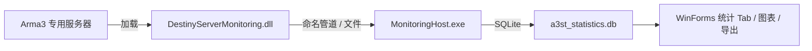

# DestinyServerMonitoring 原生 DLL 构建说明

> 关联：[architecture.md](architecture.md) · [README.md](README.md)

Arma 3 专用服务器通过 **C++ 扩展 DLL** 将 FPS、在线人数、击杀等数据写入工具目录，由 `Arma3ServerTools.MonitoringHost` 入库 SQLite。  
本仓库中的 C# 监控宿主与 WinForms 统计页**不依赖**该 DLL 即可编译运行；但若要在游戏内采集数据，仍需构建并部署原生 DLL。

## 目录位置

```
DestinyServerMonitoring/
  DestinyServerMonitoring.sln
  DestinyServerMonitoring/
    DestinyServerMonitoring.csproj   # C# + DllExport，输出原生 DLL
    ArmaMonitoringService.cs
```

## 环境要求

| 组件 | 说明 |
|------|------|
| Visual Studio 2022 | 含「使用 C++ 的桌面开发」工作负载 |
| .NET Framework 4.x 目标 | 项目为 legacy `DestinyServerMonitoring.csproj` |
| NuGet `UnmanagedExports` | 已在 `packages/` 中引用，用于导出 `DllExport` |

## 构建步骤（Windows）

1. 用 Visual Studio 打开 `DestinyServerMonitoring/DestinyServerMonitoring.sln`。
2. 选择配置 **Release**，平台 **x64**（与 64 位专用服务器一致）。
3. 生成解决方案。
4. 在输出目录（通常为 `DestinyServerMonitoring/DestinyServerMonitoring/bin/x64/Release/`）找到生成的 **DestinyServerMonitoring.dll**。
5. 将 DLL 复制到专用服务器根目录或任务配置的 `@Arma3ServerTools` 扩展路径（参见 [first-server-guide.md](first-server-guide.md)）。

## 与 .NET 工具的关系



- **MonitoringHost** 由 WinForms 主程序在启动时自动拉起（见 `MonitoringHostLauncher`）。
- **统计图表、CSV、HTML 日报** 读取同一 SQLite 数据库，无需重新编译 C++ 即可使用已有数据。

## CI 说明

当前 GitHub Actions（`.github/workflows/ci.yml`）仅执行：

- `dotnet restore / build / test`（`Arma3ServerTools.sln`）

**不包含** C++ / DllExport 项目的自动构建，原因：

1. 构建依赖 Visual Studio + legacy .NET Framework 工具链，与 Linux/macOS runner 不兼容。
2. 原生 DLL 为可选部署物，不影响 Core / Application 单元测试。

若需在 CI 中产出 DLL，可在 `windows-latest` runner 上增加独立 job，例如：

```yaml
  build-monitoring-dll:
    runs-on: windows-latest
    steps:
      - uses: actions/checkout@v4
      - name: Build DestinyServerMonitoring
        run: msbuild DestinyServerMonitoring/DestinyServerMonitoring.sln /p:Configuration=Release /p:Platform=x64
      - name: Upload DLL artifact
        uses: actions/upload-artifact@v4
        with:
          name: DestinyServerMonitoring-x64
          path: DestinyServerMonitoring/**/bin/x64/Release/*.dll
```

（需 runner 预装 MSBuild 与对应 .NET Framework 目标包。）

## 验证

1. 启动已部署 DLL 的专用服务器，并开启配置中的监控服务。
2. 在工具 **统计** Tab 点击「刷新统计」，应能看到战斗统计与服务器快照。
3. **趋势图表** Tab 应显示 FPS / 在线曲线（需有足够快照数据）。

## 故障排查

| 现象 | 可能原因 |
|------|----------|
| 数据库始终为空 | MonitoringHost 未启动、DLL 未加载、或 `EnableMonitoringService` 未勾选 |
| 仅有玩家库无快照 | RCon 有连接但 DLL 未注入；检查服务器目录与扩展配置 |
| 图表为空 | 快照不足或时间戳为 0；运行一段时间后重试 |
