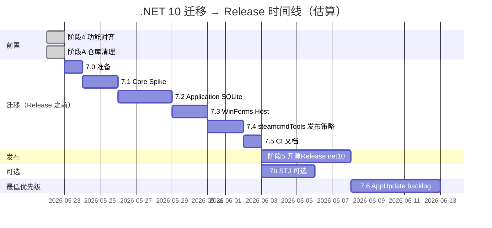

# .NET 10 迁移与 NuGet 包更新计划

> 版本：1.3 · 2026-05-22  
> 前置：阶段 4 功能对齐完成；阶段 A 仓库清理（移除 `packages/`、`bin/` 误跟踪）已完成或已提交。  
> **实施顺序**：**阶段 7（本计划）→ 阶段 5（开源 Release）**；首版公开发布以 **net10** 为基线。  
> 关联：[refactoring-plan.md](refactoring-plan.md) · [architecture.md](architecture.md)

---

## 一、目标与非目标

### 目标

| 项 | 说明 |
|----|------|
| **TFM** | 主线 `src/` + `tests/` + `steamcmdTools` 统一到 **`net10.0-windows`** |
| **LTS** | 获得 .NET 10 LTS 支持至 **2028-11**（[官方支持策略](https://dotnet.microsoft.com/en-us/platform/support/policy/dotnet-core)） |
| **依赖现代化** | 移除 NetFramework 专用 SQLite stub；测试/SDK 包升到当前稳定版 |
| **发布** | 7.5 完成后进入 **阶段 5 Release**；明确「框架依赖 vs 自包含」策略，更新 README / CI |

### 非目标（本阶段不做）

- ~~删除 `a3/` 遗留源码~~（**已完成**，2026-05-22 直接删除 `a3/`、`AppUpdate/`、`a3.sln`）
- Blazor / Web Host（原 refactoring-plan 阶段 6 Web，单独立项）
- Newtonsoft → System.Text.Json 全量替换（可选子阶段 7b，非阻塞）
- 移除 `Nito.AsyncEx`（可选在 7.1 或 net48 预清理阶段完成）
- **`AppUpdate` net10 重写**（阶段 7.6 / 阶段 8，**最低优先级 backlog**；首版 Release 不要求）
- `DestinyServerMonitoring` 原生 DLL 重写（保持 net452 构建，随 Release 分发）

### 预期收益（ realistic ）

- JSON 读写、监控 SQLite 批量写入：**小幅**性能与 GC 改善
- WinForms / 启服 / RCon：**用户感知有限**
- **主要价值**：LTS、依赖生态、与 `steamcmdTools` 栈统一、便于 CI

---

## 二、范围矩阵

| 项目 | 当前 TFM | 目标 TFM | 优先级 | 备注 |
|------|----------|----------|--------|------|
| `Arma3ServerTools.Core` | net48 | **net10.0-windows** | P0 | 含 WMI `System.Management` |
| `Arma3ServerTools.Application` | net48 | **net10.0-windows** | P0 | SQLite 必换包 |
| `Arma3ServerTools.App.WinForms` | net48 | **net10.0-windows** | P0 | `<UseWindowsForms>true</UseWindowsForms>` |
| `Arma3ServerTools.MonitoringHost` | net48 | **net10.0-windows** | P0 | 隐藏 WinForms 窗体 |
| `Arma3ServerTools.Core.Tests` | net48 | **net10.0-windows** | P0 | |
| `Arma3ServerTools.Application.Tests` | net48 | **net10.0-windows** | P0 | |
| `steamcmdTools` | net6.0-windows10.0.20348.0 | **net10.0-windows** | P1 | 消除 EOL 警告 |
| `DestinyServerMonitoring` | net452 | **保持** | P3 | RVExtension，独立 sln |
| `AppUpdate` | ~~net472 + DevExpress~~ | **net10.0-windows**（可选） | **P4（最低）** | 旧根目录已删除；阶段 8 新建或手动更新 |
| `a3/` | ~~net48 + DevExpress~~ | **已删除** | — | 功能已迁入 `src/` |

---

## 三、NuGet 包评估与迁移对照

> 评估范围：**主线 `src/` + `tests/` + `steamcmdTools`**（6 个直接 NuGet）；遗留 `a3/` / `AppUpdate` / `DestinyServerMonitoring` 在重写时再处理。

### 3.1 主线包逐项评估（`src/`）

#### SQLite — 🔴 必须更换（P0，net10 阻塞）

| | |
|--|--|
| **当前** | `Stub.System.Data.SQLite.Core.NetFramework` 1.0.119 |
| **问题** | 仅面向 .NET Framework；net10 不可用；维护停滞 |
| **推荐** | **`Microsoft.Data.Sqlite` 9.x**（随 .NET 10 SDK 对齐） |
| **备选** | `SQLitePCLRaw.bundle_e_sqlite3` — 更底层，一般不必单独引用 |
| **不推荐** | 旧版 `System.Data.SQLite` 非官方包；EF6 + SQLite（无 ORM 需求） |
| **改动文件** | `MonitoringDatabase.cs`、`PlayerDatabaseRepository.cs` |

#### Nito.AsyncEx — 🟡 建议移除（P1，非阻塞）

| | |
|--|--|
| **当前** | `Nito.AsyncEx` 5.1.2（传递引入 **8 个** DLL） |
| **用途** | 仅 3 处 `AsyncManualResetEvent`（`RconClient`、`NetworkRequest`） |
| **推荐** | **方案 A（首选）**：Core 内实现 ~40 行 `AsyncManualResetEvent`（基于 `TaskCompletionSource`）<br>**方案 B**：`SemaphoreSlim(0,1)` + `Release`/`WaitAsync` |
| **不推荐** | 继续引用 meta 包；若暂留仅引 `Nito.AsyncEx.Coordination` |
| **收益** | 减少传递依赖与发布目录 DLL 数量 |

#### Newtonsoft.Json — 🟢 可选升级（P2）

| | |
|--|--|
| **当前** | `Newtonsoft.Json` 13.0.3，封装于 `Core/IO/JsonSerializer.cs` |
| **net10 保守** | 保留 **Newtonsoft 13.0.4+**（与历史 `config/*.json` 100% 兼容） |
| **net10 优化** | **`System.Text.Json` 9.x**（BCL，更快，无额外包；见阶段 7b） |
| **建议** | 迁移 net10 时**先保留 Newtonsoft**；稳定后再做 STJ 专项 |

#### Quartz — 🟢 保留，升版本（P1）

| | |
|--|--|
| **当前** | `Quartz` 3.13.1 |
| **推荐** | **Quartz 3.15.x** |
| **备选** | `Cronos` + `PeriodicTimer` — 更轻，需重写 `SchedulerService`，收益有限 |
| **不推荐** | `Coravel` / `Hangfire` — 面向 Web/后台，不适合桌面单进程 |
| **理由** | 已集成 Cron 调度，换库成本高、收益低 |

#### System.Management — 🟢 保留，升版本（P1）

| | |
|--|--|
| **当前** | `System.Management` 8.0.0 |
| **推荐** | **`System.Management` 9.0.x** |
| **用途** | `MachineCodeTools` WMI 硬件指纹 |
| **备选** | 去掉 WMI — 指纹稳定性变差；无更好 WMI 第三方包 |
| **注意** | 仅 Windows，与 WinForms 专服工具场景一致 |

#### HttpWebRequest — 🟡 建议现代化（P1，BCL 非 NuGet）

| | |
|--|--|
| **当前** | `SteamWorkshopApiService` 内 `HttpWebRequest`（1 处） |
| **推荐** | **`HttpClient`** + `PostAsync`；可注入或静态单例 |
| **不推荐** | RestSharp、Flurl — 单接口 POST 用 BCL 足够 |
| **时机** | 阶段 7.2 Application 迁移一并完成 |

#### System.IO.Compression — 🟢 删除手动引用（P0）

| | |
|--|--|
| **当前** | `Application.csproj` 手动 `<Reference Include="System.IO.Compression" />` |
| **推荐** | 删除 Reference，使用 SDK 自带 `System.IO.Compression` / `ZipFile` |
| **用途** | `SteamCmdBootstrapper` 解压 zip |

---

### 3.2 测试包评估（`tests/`）

| 包 | 当前 | 目标 | 说明 |
|----|------|------|------|
| **Microsoft.NET.Test.Sdk** | 17.11.1 | **17.14.x** 或 **18.0.x** | 支持 .NET 10 测试宿主 |
| **xunit** | 2.9.2 | **2.9.3** 或暂留 | 无需换 NUnit/MSTest |
| **xunit.runner.visualstudio** | 2.8.2 | **3.0.x** | 与 VS 2022+ 匹配 |

**可选增强**（非替换）：`FluentAssertions`（断言可读性）、`NSubstitute`（mock `IProcessRunner` 等）。

---

### 3.3 steamcmdTools

| 包 | 当前 | 评估 |
|----|------|------|
| **SteamCMD.ConPTY** | 1.2.0 | **暂保留** — steamcmd 伪控制台，WM_COPYDATA 链路依赖 |

**仅当 net10 不兼容时备选**：标准 `Process` 重定向 stdin/stdout（可能损失交互能力）。迁移时先联调，不必 preemptively 换包。

---

### 3.4 遗留工程包（重写时再动，不迁入 net10）

| 遗留包 | 出现位置 | 新版建议 |
|--------|----------|----------|
| **DevExpress *** | `a3/`、`AppUpdate/` | **删除** — 已用标准 WinForms |
| **SharpZipLib** | `AppUpdate/ZipHelper.cs` | → **`System.IO.Compression.ZipArchive`** |
| **Costura.Fody** | `AppUpdate/` | → **自包含发布** / `PublishSingleFile` |
| **Entity Framework 6** | `a3/` | 新版无 ORM → **`Microsoft.Data.Sqlite` 原生 SQL** |
| **Stub/System.Data.SQLite 全家桶** | `a3/` | 同上 |
| **CronExpressionDescriptor** | `a3/` UI | 可选保留 NuGet（Cron 人类可读描述，非必须） |
| **UnmanagedExports** | `DestinyServerMonitoring/` | **保持** 直至 DLL 重写 |

---

### 3.5 目标依赖清单（net10 主线完成后）

```text
Arma3ServerTools.Core
  System.Management              9.x          （若保留 MachineCodeTools）
  （无 Nito.AsyncEx）

  JSON 二选一：
    A) 无 NuGet — System.Text.Json（BCL，阶段 7b）
    B) Newtonsoft.Json           13.0.4+     （保守，阶段 7.1～7.2）

Arma3ServerTools.Application
  Microsoft.Data.Sqlite          9.x
  Quartz                         3.15.x
  （无 Stub SQLite、无手动 Compression Reference）

Tests
  Microsoft.NET.Test.Sdk         17.14+ / 18.x
  xunit                          2.9.x
  xunit.runner.visualstudio      3.0.x

steamcmdTools
  SteamCMD.ConPTY                1.2.0        （验证通过后保留）
```

**预期**：发布目录传递 DLL 从当前约 **15+**（含 Nito 链、旧 SQLite 原生）降至 **~5**。

---

### 3.6 包动作优先级总表

| 动作 | 包 / 技术 | 优先级 | net10 阻塞 |
|------|-----------|--------|------------|
| **必换** | SQLite → `Microsoft.Data.Sqlite` | P0 | ✅ |
| **必删** | `Stub.System.Data.SQLite.Core.NetFramework` | P0 | ✅ |
| **必删** | 手动 `System.IO.Compression` Reference | P0 | ✅ |
| **建议移除** | `Nito.AsyncEx` → 内联 AsyncManualResetEvent | P1 | ❌ |
| **建议换** | `HttpWebRequest` → `HttpClient` | P1 | ❌ |
| **版本升级** | Quartz、System.Management、Test SDK | P1 | ❌ |
| **可选** | Newtonsoft → `System.Text.Json` | P2 | ❌ |
| **保留** | Quartz、System.Management、xUnit | — | — |
| **保留待验证** | SteamCMD.ConPTY | — | — |

---

### 3.7 可选后续（阶段 7b）

| 项 | 说明 |
|----|------|
| **System.Text.Json** | 替换 `JsonSerializer.cs`；需回归测试 JSON 配置 round-trip |
| **配置 JSON 基准** | 迁移前后大配置文件读写耗时对比 |

---

## 四、代码改动清单

### 4.1 必改（阻塞编译/运行）

| 位置 | net48 用法 | net10 改法 |
|------|------------|------------|
| `AppDomain.CurrentDomain.SetupInformation.ApplicationBase` | 4 处 | `AppContext.BaseDirectory` |
| `System.Data.SQLite` | Application 层 2 文件 | `Microsoft.Data.Sqlite` + 参数化 SQL 保持不变 |
| `Arma3ServerTools.App.WinForms.csproj` | `net48` | `net10.0-windows` + `UseWindowsForms` |
| MSBuild `CopyMonitoringHost` / `CopySteamCmdTools` | 输出路径 `net48` | 改为 `net10.0-windows` |
| `Application.csproj` 手动 `Reference` Compression | 旧式引用 | 删除 ItemGroup |

### 4.2 建议改（非阻塞）

| 位置 | 说明 |
|------|------|
| `RconClient.cs` / `NetworkRequest.cs` | 移除 `Nito.AsyncEx`，内联 `AsyncManualResetEvent`（见 §3.1） |
| `SteamWorkshopApiService.cs` | `HttpWebRequest` → `HttpClient`（见 §3.1） |
| `Directory.Build.props`（新建） | 统一 `LangVersion=latest`、`Nullable=disable`（与现网一致） |
| `global.json`（可选） | 锁定 SDK 10.0.x，避免 CI/本机漂移 |

### 4.3 无需改

| 项 | 原因 |
|----|------|
| User32 P/Invoke / WM_COPYDATA | 跨版本稳定 |
| BattlEye RCon 协议代码 | 纯 BCL + Socket |
| WinForms 控件代码 | 标准控件，无 DevExpress |

---

## 五、分阶段实施（建议 7～12 工作日）

### 阶段 7.0 — 准备（0.5～1 天）

**前置：** 阶段 4 功能对齐验收通过 + 阶段 A 仓库清理完成（**不要求**先行 Release；**不要求** AppUpdate 方案）。

- [ ] 安装 [.NET 10 SDK](https://dotnet.microsoft.com/download) + **Windows Desktop Runtime 10**
- [ ] （推荐）在 `main` 打 net48 快照 tag `v1.x-net48`，便于回滚对照
- [ ] 新建分支 `feature/net10-migration`
- [ ] 添加 `global.json`（可选）：`"version": "10.0.1xx"`
- [ ] 添加 `Directory.Build.props` 统一属性
- [ ] 记录迁移前基准：`dotnet test` 全绿 + Release 构建产物大小

**验收：** 本机 `dotnet --version` 为 10.x；分支从干净 `main` 切出。

---

### 阶段 7.1 — Core + Tests Spike（1～2 天）

- [ ] `Arma3ServerTools.Core.csproj` → `net10.0-windows`
- [ ] 升级 `System.Management` 9.x、`Newtonsoft.Json` 13.0.4+（或暂留版本）
- [ ] **移除 `Nito.AsyncEx`**：Core 内实现 `AsyncManualResetEvent`（`RconClient`、`NetworkRequest`）
- [ ] `AppContext.BaseDirectory` 替换（若 Core 内无则跳过）
- [ ] `Arma3ServerTools.Core.Tests` → `net10.0-windows`，升级测试包（§3.2）
- [ ] `dotnet test` Core.Tests 全绿

**验收：** Core 独立编译；**30+** 单元测试通过；输出目录无 Nito 相关 DLL。

**回滚：** 仅改 Core + Core.Tests，可单独 revert。

**可选（net48 预清理）：** 在切 TFM 前于 `main` 单独 PR 完成 Nito 移除，降低 7.1 差异面。

---

### 阶段 7.2 — Application + SQLite（2～3 天）

- [ ] `Application.csproj` → `net10.0-windows`
- [ ] 移除 `Stub.System.Data.SQLite.Core.NetFramework`；引入 `Microsoft.Data.Sqlite` 9.x（§3.1）
- [ ] 删除手动 `System.IO.Compression` Reference
- [ ] 迁移 `MonitoringDatabase.cs`、`PlayerDatabaseRepository.cs`：
  - `SQLiteConnection` → `Microsoft.Data.Sqlite.SqliteConnection`
  - 连接字符串格式保持 `Data Source=...`
  - 确认 `using` / `Dispose` 在测试中无泄漏
- [ ] 升级 `Quartz` 3.15.x；跑 `SchedulerService` 相关测试
- [ ] **`SteamWorkshopApiService`：`HttpWebRequest` → `HttpClient`**
- [ ] `Application.Tests` → `net10.0-windows`，全绿

**验收：** **35** Application 测试通过；监控入库/玩家库 round-trip 测试通过；无 Stub SQLite DLL。

**风险点：** SQLite 并发写入——重点跑 `QueuedMonitoringIngestServiceTests`。

---

### 阶段 7.3 — WinForms + MonitoringHost（1～2 天）

- [ ] `MonitoringHost`、`App.WinForms` → `net10.0-windows`
- [ ] 更新 `CopyMonitoringHost`、`CopySteamCmdTools` 目标路径
- [ ] 全解决方案 `dotnet build -c Release`
- [ ] 手工冒烟：
  - 英文路径启动主程序
  - 加载/保存服务器配置
  - 拉起 MonitoringHost（WM_COPYDATA 窗口标题不变）
  - 模组下载入口（steamcmdTools 复制路径正确）

**验收：** `Arma3ServerTools.exe` + `monitoring/MonitoringHost.exe` 可运行；无 DevExpress 依赖。

---

### 阶段 7.4 — steamcmdTools + 发布策略（1～2 天）

- [ ] `steamcmdTools.csproj` → `net10.0-windows`（去掉 `-windows10.0.20348.0` 细分 TFM）
- [ ] 验证 WM_COPYDATA 与主程序联调
- [ ] 选定发布模式（二选一或双轨）：

| 模式 | 优点 | 缺点 |
|------|------|------|
| **框架依赖** | 体积小（~5～15 MB） | 用户需装 [.NET 10 Desktop Runtime](https://dotnet.microsoft.com/download) |
| **自包含** `SelfContained=true` | 开箱即用 | 体积 +50～80 MB/架构 |

- [ ] 更新 `README.md` 构建与运行时要求
- [ ] 可选：`scripts/publish-release.ps1`

**验收：** 干净 Windows VM 或本机无 net48 环境下，Release 包可启动。

---

### 阶段 7.5 — CI 与文档（1 天）

- [ ] GitHub Actions：`windows-latest` + SDK 10.x
  ```yaml
  - uses: actions/setup-dotnet@v4
    with:
      dotnet-version: '10.0.x'
  - run: dotnet test Arma3ServerTools.sln -c Release
  ```
- [ ] 更新 `refactoring-plan.md` 阶段 7 勾选；**阶段 5 Release 待 7.5 完成后启动**
- [ ] 更新 `architecture.md` TFM 表

**验收：** CI 绿；文档与真实 TFM 一致。

---

### 阶段 7b（可选）— JSON 现代化

- [ ] `JsonSerializer.cs` → `System.Text.Json` 9.x（保留日期格式兼容，§3.1）
- [ ] 配置 JSON 大文件基准测试（迁移前后对比）

**工期：** +2～3 天；**非迁移阻塞项**（HttpClient 已在 7.2 完成）。

---

### 阶段 7.6 — AppUpdate（**P4 / 最低优先级 backlog**）

> **排序**：在 7.0～7.5 主线、7b、阶段 6 Web 等之后；有资源再做。net10 主线 **Definition of Done 不依赖** 本阶段。

**前置：** 7.5 迁移 DoD 达成；AppUpdate 需求明确时再启动。

- [ ] 新建 `src/Arma3ServerTools.AppUpdate`（net10.0-windows 标准 WinForms）
- [ ] 迁移 Zip / HTTP 逻辑：**SharpZipLib → `ZipArchive`，Costura → 自包含发布**（§3.4）
- [ ] 主程序启动更新器路径接线
- [ ] 废弃根目录 `AppUpdate/`（标记 DEPRECATED）

**过渡期：** Release 可继续附带旧 `AppUpdate/`（net472）或 README 说明手动覆盖更新；不影响主程序 net10 运行。

**工期：** +3～5 天（独立里程碑，**无排期承诺**）。

---

## 六、时间线总览



| 里程碑 | 工期（1 人） | 累计 |
|--------|-------------|------|
| 7.0～7.5 net10 迁移 | **7～11 天** | **迁移 DoD 达成，可进入阶段 5** |
| 阶段 5 开源 Release | **3～5 天** | **v1.0 首版公开发布（net10）** |
| +7b 可选优化（STJ） | +2～3 天 | JSON 性能/零 NuGet JSON 依赖 |
| +7.6 AppUpdate（最低） | +3～5 天 | 自动升级链；**非首版 Release 必需** |

---

## 七、风险与缓解

| 风险 | 等级 | 缓解 |
|------|------|------|
| SQLite API 差异 | 中 | 65 项自动化测试 + 真库文件回归 |
| Quartz 行为变化 | 低 | Cron 集成测试 + 手工触发重启任务 |
| 用户未装 Desktop Runtime | 高 | 阶段 5 Release 安装程序检测 / 提供 self-contained 包 |
| steamcmdTools ConPTY 不兼容 net10 | 中 | 保留 net6 构建副本直至验证通过 |
| WinForms 行为差异 | 低 | 冒烟清单覆盖主要 Tab |
| 迁移中途功能回归 | 中 | 每子阶段 `dotnet test` + 7.3 冒烟清单 |
| 推迟 Release 窗口 | 低 | **有意为之**：首版以 net10 发布，避免 net48→net10 双次打包 |

**回滚策略：** 每个子阶段独立 PR；7.0 前打 `v1.x-net48` tag；net10 稳定并完成阶段 5 后再弃用 net48 分支。

---

## 八、验收标准（Definition of Done）

- [ ] `dotnet test Arma3ServerTools.sln -c Release` — **0 失败，0 跳过**
- [ ] `dotnet build Arma3ServerTools.sln -c Release` — **0 错误**
- [ ] 无 `net48` / `Stub.System.Data.SQLite.Core.NetFramework` / `Nito.AsyncEx` 引用
- [ ] 英文路径手工冒烟清单全部通过（见 7.3）
- [ ] README 写明运行时要求或提供 self-contained 包
- [ ] （可选）CI workflow 在 PR 上自动跑测试

---

## 九、与 refactoring-plan 的衔接

| 原计划 | 本计划 |
|--------|--------|
| 阶段 5：开源 Release | **置于阶段 7 之后**；首版 v1.0 基于 **net10** |
| 阶段 6：Blazor Web | **不变**；与 net10 迁移正交，共用 Application 层 |
| TFM「阶段 6 评估 .NET 8」 | **升级为阶段 7：.NET 10 LTS**（跳过 8/9 中间版） |

**实施顺序（阶段 4 完成后）**：**7.0～7.5 → 阶段 5 Release →（可选）7b / 阶段 6 → 阶段 8 AppUpdate**。

---

## 十、立即下一步（推荐顺序）

1. **提交**阶段 A 仓库清理（若尚未 commit/push）
2. **执行**阶段 7.0 准备 + **7.1 Core Spike**（1 PR，风险最低）
3. 7.1 绿后依次 7.2～7.5，完成 net10 迁移 DoD
4. **再进入**阶段 5 开源 Release（README、net10 运行时说明、发布包）

如需启动 7.1，可从 `Arma3ServerTools.Core.csproj` 改 TFM 与包版本开始。

---

## 修订记录

| 版本 | 日期 | 说明 |
|------|------|------|
| 1.3 | 2026-05-22 | 升级计划置于 Release **之前**；阶段 5 改为 7.5 之后的首版 net10 发布 |
| 1.2 | 2026-05-22 | AppUpdate 降为 P4 最低优先级 backlog；7.6 置于 7b 之后；不阻塞 Release / DoD |
| 1.1 | 2026-05-22 | 补充 §3 包逐项评估、目标依赖清单、优先级总表；7.1/7.2/7b 与包决策对齐 |
| 1.0 | 2026-05-22 | 初版：net10.0-windows 主线、包对照、7 子阶段、工期估算 |
