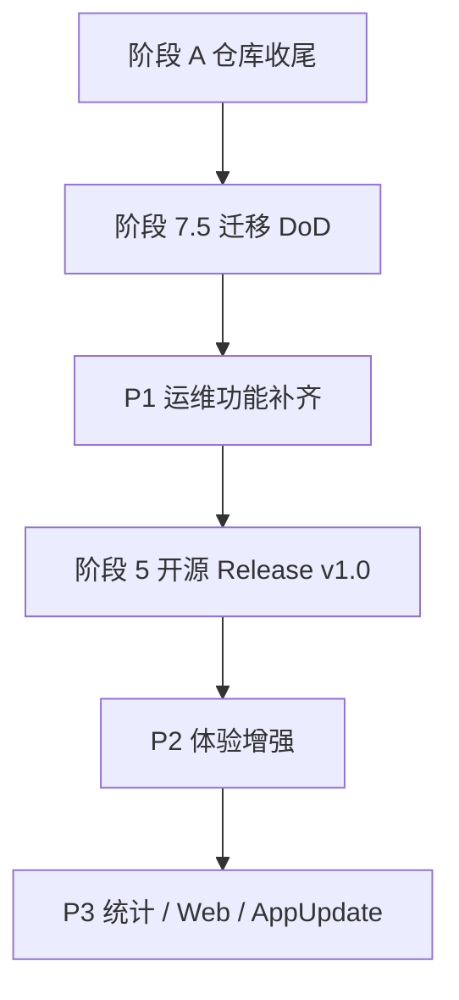

# Arma3 开服工具 — 完整计划清单

> 文档版本：1.0  
> 更新日期：2026-05-22（v1.0.0 收尾）  
> 状态：实施参考 / 产品 backlog  
> 关联文档：[refactoring-plan.md](refactoring-plan.md) · [architecture.md](architecture.md) · [net10-migration-plan.md](net10-migration-plan.md)

本文档是**面向 v1.0 公开发布及之后迭代**的完整任务清单，与 [refactoring-plan.md](refactoring-plan.md) 的分阶段架构计划互补：  
后者侧重架构与迁移；**本文档侧重「还要做什么、优先级、验收标准」**。

---

## 一、如何使用本清单

| 符号 | 含义 |
|------|------|
| ✅ | 已完成 |
| 🔄 | 部分完成 / 需收尾 |
| ⬜ | 待办 |
| ❌ | 已取消 / 明确不做 |
| **P0** | 阻塞 v1.0 Release |
| **P1** | v1.0 强烈建议（日常运维必需） |
| **P2** | v1.0 可选增强（体验明显更好） |
| **P3** | v1.x 迭代 |
| **P4** | 长期 backlog |

**建议实施顺序：**

---

## 二、当前基线（v1.0.0）

### 2.1 已完成

| 区域 | 内容 |
|------|------|
| 架构 | Core / Application / WinForms 分层；AntdUI 设置页 |
| TFM | 主线 `net10.0-windows` |
| 开服 | 配置 CRUD、写 cfg、进程启停、定时任务（Quartz） |
| 设置页 | 概览 / 基本 / 网络 / 安全 / 性能 / 日志 / 难度 / 模组 / 任务 / 定时 / 统计 / RCon / 封禁 |
| SteamCMD | 配置、下载 steamcmd 本体、安装/更新专用服务器（AppID 233780） |
| 模组 | 扫描、勾选、HTML 导入启用、本地添加、Bikey 自动复制 |
| RCon | 连接、玩家列表、踢人、公告/私信、BE 封禁、任务列表、加载任务、重启/锁定 |
| 封禁 | 本地 `bans.txt` 读写 + RCon 在线封禁 |
| 监控 | MonitoringHost + SQLite；统计表格、ScottPlot 图表、CSV/HTML 导出 |
| 体验 | 快速向导、启动前检查、RPT 查看、列表搜索、桌面退出通知 |
| 测试 | `dotnet test` 74 项（Core + Application） |
| CI / 发布 | GitHub Actions；`scripts/build-release.ps1` + zip；`Directory.Build.props` v1.0.0 |
| 清理 | 删除旧 `a3/`、`AppUpdate/`、`steamcmdTools` 内置模组下载 |

### 2.2 发布前待维护者操作

| 项 | 说明 |
|----|------|
| A-01 | 提交全部变更（见 [release-v1.0.0.md](release-v1.0.0.md)） |
| 5-06 | `git tag v1.0.0` + GitHub Release 上传 zip |

### 2.3 已知非阻塞 backlog

- 列表排序（P2-05）、托盘最小化（P2-06）
- RCon 运行时改密（P1-09）、AppUpdate（阶段 8）
- Blazor Web 远程管理（阶段 6）

### 2.4 已明确取消

| 项 | 原因 |
|----|------|
| 内置 Workshop 模组下载（steamcmdTools） | 2026-05-22 按需求删除；改由用户自行运行 SteamCMD |
| 社区联合封禁 URL | 仅保留本地 `bans.txt` |
| 迁移旧 DevExpress `a3/` | 已删除，功能迁入 `src/` |

---

## 三、总体阶段与里程碑

| 阶段 | 名称 | 状态 | 目标 |
|------|------|------|------|
| 0～4 | Core / 服务 / MVP / 功能对齐 | ✅ | 可开服、主要设置可用 |
| A | 仓库清理 | 🔄 | 代码就绪；待 git 提交 |
| 7 | net10 迁移 | ✅ | TFM net10；CI + DoD 完成 |
| **P1** | **运维功能补齐** | ✅ | v1.0 前强烈建议 |
| 5 | 开源 Release v1.0 | 🔄 | 打包脚本就绪；待 tag |
| P2 | 体验增强 | 🔄 | 核心完成；排序/托盘待做 |
| 6 | Blazor Web（可选） | ⬜ | 远程管理 |
| 8 | AppUpdate | ⬜ | 自动更新（P4） |

| 里程碑 | 内容 | 目标日期（参考） |
|--------|------|------------------|
| **M5** | net10 DoD + 仓库清理提交 | 第 7～8 周 |
| **M5.5** | P1 运维清单完成 | M5 后 1～2 周 |
| **M6** | **v1.0 Release  tag** | 第 8～9 周 |
| M7 | v1.1 体验 + 统计图表 | Release 后 4～6 周 |

---

## 四、完整任务清单（总表）

> 勾选列供实施时更新；`ID` 便于 Issue / PR 引用。

### 4.1 阶段 A — 仓库收尾

| ID | 优先级 | 任务 | 状态 | 估时 | 验收标准 |
|----|--------|------|------|------|----------|
| A-01 | P0 | 提交当前删除/重构变更（a3、AppUpdate、steamcmdTools、模组下载） | ⬜ | S | `git status` 干净或仅剩 intentional 未跟踪项 |
| A-02 | P0 | 同步 README / architecture / refactoring-plan / net10-plan 与现状 | ✅ | S | 无「待归档 a3」等过时表述 |
| A-03 | P1 | 补充《首次开服指南》单页文档 | ✅ | M | 含 steamcmd、监控 DLL、英文路径、写 cfg 顺序 |
| A-04 | P2 | 清理本地 `packages/`、`.vs/` 缓存说明写入 README | ✅ | S | 文档即可，不强制删 Git 外目录 |

### 4.2 阶段 7 — net10 迁移 DoD（收尾）

| ID | 优先级 | 任务 | 状态 | 估时 | 验收标准 |
|----|--------|------|------|------|----------|
| 7-01 | P0 | 确认全解决方案 `net10.0-windows` 无 net48 残留 | ✅ | — | 所有 `.csproj` TFM 一致 |
| 7-02 | P0 | `Microsoft.Data.Sqlite` 替换完成 | ✅ | — | 无 Stub SQLite |
| 7-03 | P0 | 移除 `Nito.AsyncEx` | ✅ | — | 使用 `AsyncManualResetEvent` |
| 7-04 | P1 | `SteamCmdBootstrapper` WebClient → HttpClient | ✅ | S | 无 SYSLIB0014 警告（可选 P1） |
| 7-05 | P0 | 英文路径冒烟清单（手动） | ✅ | M | 新建→写 cfg→启停→RCon 连接 文档化 |
| 7-06 | P0 | 更新 refactoring-plan 阶段 7 勾选 | ✅ | S | 与真实 TFM 一致 |
| 7-07 | P0 | **GitHub Actions**：`dotnet restore/build/test` | ✅ | M | PR 上 CI 绿 |
| 7-08 | P0 | Release 构建脚本（framework-dependent + self-contained 二选一或双包） | ✅ | M | 产物含 MonitoringHost + sql 架构 |
| ~~7-09~~ | — | ~~steamcmdTools net10~~ | ❌ | — | 已取消 |

### 4.3 P1 — 运维功能补齐（v1.0 强烈建议）

| ID | 优先级 | 任务 | 状态 | 估时 | 依赖 | 验收标准 |
|----|--------|------|------|------|------|----------|
| P1-01 | P1 | **RCon 在线封禁**：临时 / 永久 | ✅ | S | — | 玩家表选中→填原因→封禁；调用 `BanOnlinePlayerAsync` |
| P1-02 | P1 | **本地封禁添加**：手动录入 GUID + 原因 | ✅ | S | — | BansPanel「添加」→保存写入 `bans.txt` |
| P1-03 | P1 | **RCon 加载任务**：选中 mission → `#mission` | ✅ | S | — | `LoadMissionCommand` + `RconService.LoadMissionAsync` + UI 按钮 |
| P1-04 | P1 | **EnableMonitor UI**：勾选启用 `@destiny_server` | ✅ | S | — | 安全/性能/定时任一页增加开关；写 cfg 含 serverMod |
| P1-05 | P1 | **EnableMonitoringService UI**：统计入库开关 | ✅ | S | — | 与 MainForm 启停逻辑一致；默认说明文案 |
| P1-06 | P1 | **复制服务器配置** | ✅ | M | — | 菜单「复制为新建」：新 UUID、可选新 ServerDir |
| P1-07 | P1 | **Bikey 管理对话框** | ✅ | M | — | 列表 Keys 目录；可打开文件夹；非 MessageBox |
| P1-08 | P1 | **RCon 连接地址可配置** | ✅ | S | — | 默认 127.0.0.1；可填 LAN IP |
| P1-09 | P2 | RCon：修改 RCon 密码（运行时） | ⬜ | S | P1-08 | `ChangeRconPasswordCommand` |
| P1-10 | P2 | RCon：LoadBans/SaveBans 与本地 bans 同步说明 | ⬜ | M | — | 文档或一键「写入 BE」 |

### 4.4 阶段 5 — 开源 Release v1.0

| ID | 优先级 | 任务 | 状态 | 估时 | 验收标准 |
|----|--------|------|------|------|----------|
| 5-01 | P0 | Release 不含 DevExpress / 旧 a3 二进制 | ✅ | — | 仓库已删 |
| 5-02 | P0 | README：构建、运行、**.NET 10 Desktop Runtime** | ✅ | M | 新用户可按 README 跑通 |
| 5-03 | P0 | README：`extension/steamcmd` 手动放置说明 | ✅ | S | 与 SteamCmdBootstrapper 下载逻辑一致 |
| 5-04 | P0 | README：DestinyServerMonitoring / `@destiny_server` 部署 | ✅ | M | 链到 A-03 或内嵌简版 |
| 5-05 | P0 | LICENSE + NOTICE 完整 | ✅ | S | Apache 2.0 + THIRD-PARTY-NOTICES |
| 5-06 | P0 | 打 tag `v1.0.0` + GitHub Release 附件 | 🔄 | S | 见 release-v1.0.0.md |
| 5-07 | P1 | 版本号写入程序集 / 关于页 | ✅ | S | Directory.Build.props 1.0.0 |
| 5-08 | P1 | **关于**对话框（版本、许可、链接） | ✅ | S | 工具菜单入口 |
| 5-09 | P2 | 安装包（MSIX / Inno Setup / zip） | ✅ | S | build-release.ps1 产出 zip |

### 4.5 P2 — 体验与 onboarding

| ID | 优先级 | 任务 | 状态 | 估时 | 验收标准 |
|----|--------|------|------|------|----------|
| P2-01 | P2 | **快速配置向导** | ✅ | L | 新服务器：目录、端口、RCon、BE、保存+写 cfg |
| P2-02 | P2 | **启动前检查** | ✅ | M | 端口占用、路径、cfg、可执行文件；启动时阻塞错误 |
| P2-03 | P2 | **首页 / 仪表盘** | 🔄 | L | 概览 Tab：状态、PID、RPT；在线数待 RCon 集成 |
| P2-04 | P2 | **RPT / 日志查看** | ✅ | M | tail 最近 RPT；概览页入口 |
| P2-05 | P2 | 服务器列表排序 / 搜索 | 🔄 | S | 搜索已实现；排序待做 |
| P2-06 | P3 | 托盘最小化 + 运行中图标 | ⬜ | M | 可选 |

### 4.6 P3 — 统计与监控深化

| ID | 优先级 | 任务 | 状态 | 估时 | 验收标准 |
|----|--------|------|------|------|----------|
| P3-01 | P3 | 统计 **图表**（FPS、在线、击杀趋势） | ✅ | L | ScottPlot 趋势 Tab |
| P3-02 | P3 | 统计 / 玩家库 **CSV 导出** | ✅ | M | 统计 Tab 导出按钮 |
| P3-03 | P3 | 监控报告（按日汇总 PDF/HTML） | ✅ | M | HTML 日报导出 |
| P3-04 | P3 | 进程退出 / 崩溃 **桌面通知** | ✅ | M | NotifyIcon 气泡提示 |
| P3-05 | P3 | C++ `DestinyServerMonitoring` 构建说明入 CI | ✅ | M | docs/monitoring-cpp-dll-build.md |

### 4.7 阶段 6 — Web 管理（可选）

| ID | 优先级 | 任务 | 状态 | 估时 | 验收标准 |
|----|--------|------|------|------|----------|
| 6-01 | P3 | `Arma3ServerTools.Host` Blazor Server 项目 | ⬜ | XL | 共用 Application |
| 6-02 | P3 | 认证（本地密码 / API Key） | ⬜ | L | 最小可行 |
| 6-03 | P3 | 远程：列表、启停、RCon 只读 | ⬜ | XL | MonitoringHost 不变 |

### 4.8 阶段 8 — AppUpdate（P4）

| ID | 优先级 | 任务 | 状态 | 估时 | 验收标准 |
|----|--------|------|------|------|----------|
| 8-01 | P4 | 新建 `Arma3ServerTools.AppUpdate`（net10 WinForms） | ⬜ | L | 无 DevExpress |
| 8-02 | P4 | 主程序「检查更新」入口 | ⬜ | M | 可跳过，文档说明手动更新 |
| 8-03 | P4 | 版本 manifest + 增量/全量 zip | ⬜ | L | GitHub Releases API |

### 4.9 技术债与质量

| ID | 优先级 | 任务 | 状态 | 估时 | 验收标准 |
|----|--------|------|------|------|----------|
| Q-01 | P1 | Application 层 **RCon 集成测试**（可选 mock server） | ⬜ | L | 或 documented manual test plan |
| Q-02 | P2 | `AesEncryption` 改用 `Aes.Create()` | ✅ | S | 消除 SYSLIB0021 |
| Q-03 | P2 | 阶段 7b：Newtonsoft → System.Text.Json（可选） | ⬜ | L | 非阻塞 |
| Q-04 | P2 | WinForms **关键路径 UI 测试**（Playwright / 手动 checklist） | ⬜ | L | 发布前 regression 表 |
| Q-05 | P1 | 发布前 **中文路径** 仍禁止 — UI 提示强化 | 🔄 | S | 已有规则，补向导内说明 |

---

## 五、分 Sprint 建议（参考 2 周一轮）

### Sprint 1 — 发布基础（P0）

- A-01、A-02  
- 7-07 GitHub Actions  
- 7-08 Release 脚本  
- 5-02～5-06 README + tag  

**出口：** CI 绿、可下载 zip、文档可跟做。

### Sprint 2 — 运维必需（P1 核心）

- P1-01～P1-06  
- 5-08 关于页  
- A-03 首次开服指南  

**出口：** 管理员无需改 JSON / 手改 bans.txt 即可完成日常封禁与多服复制。

### Sprint 3 — 体验（P1 尾 + P2）

- P1-07～P1-08  
- P2-01 快速向导（最小版）  
- P2-04 日志查看  

**出口：** 新用户 15 分钟内完成首服配置。

### Sprint 4+ — v1.1

- P2-03 仪表盘  
- P3-01 统计图表  
- 6-xx 或 8-xx 按资源选做  

---

## 六、测试与发布门禁（Go / No-Go）

### 6.1 每次 PR

- [ ] `dotnet build Arma3ServerTools.sln -c Release`  
- [ ] `dotnet test Arma3ServerTools.sln -c Release`  
- [ ] 无新增 DevExpress / 硬编码密钥  

### 6.2 v1.0 Release 前（手动冒烟）

- [ ] 英文路径下：新建配置 → 写 cfg → 启动 → 停止  
- [ ] SteamCMD 安装专用服务器（或文档跳过 + 假目录）  
- [ ] RCon：连接 → 踢人 → **封禁（P1-01 后）**  
- [ ] 定时任务保存后 Quartz 同步  
- [ ] 模组扫描 + HTML 启用（已下载模组）  
- [ ] 本地封禁读/写/删  
- [ ] MonitoringHost 启动 + 统计 Tab 有数据（EnableMonitoringService 开启时）  

### 6.3 非目标（v1.0 不要求）

- 内置 Workshop 模组下载  
- 社区联合封禁  
- 与旧 DevExpress UI 像素一致  
- Steam 主服务器浏览器查询  

---

## 七、风险登记

| 风险 | 影响 | 缓解 |
|------|------|------|
| 用户未装 .NET 10 Desktop Runtime | 无法启动 | self-contained 包或安装程序检测 |
| 监控 DLL / `@destiny_server` 部署复杂 | 统计功能闲置 | A-03 文档 + P1-04/P1-05 UI |
| RCon 仅测 localhost | 远程管理失败 | P1-08 + 手动 LAN 测试 |
| 无 AppUpdate | 升级靠手动 | 5-03 + 8-xx 后续 |
| WinForms 无 UI 自动化 | 回归靠人工 | Q-04 checklist |

---

## 八、文档维护

| 变更类型 | 更新文档 |
|----------|----------|
| 新功能验收 | 本文档对应 ID 状态 + [architecture.md](architecture.md) |
| 架构 / 分层 | [refactoring-plan.md](refactoring-plan.md) |
| TFM / 包 / CI | [net10-migration-plan.md](net10-migration-plan.md) |
| 用户可见行为 | [README.md](../README.md) |

---

## 九、修订记录

| 版本 | 日期 | 说明 |
|------|------|------|
| 1.1 | 2026-05-22 | Sprint 1～2：P1 运维功能、CI、Release 脚本、首次开服指南、关于页 |
