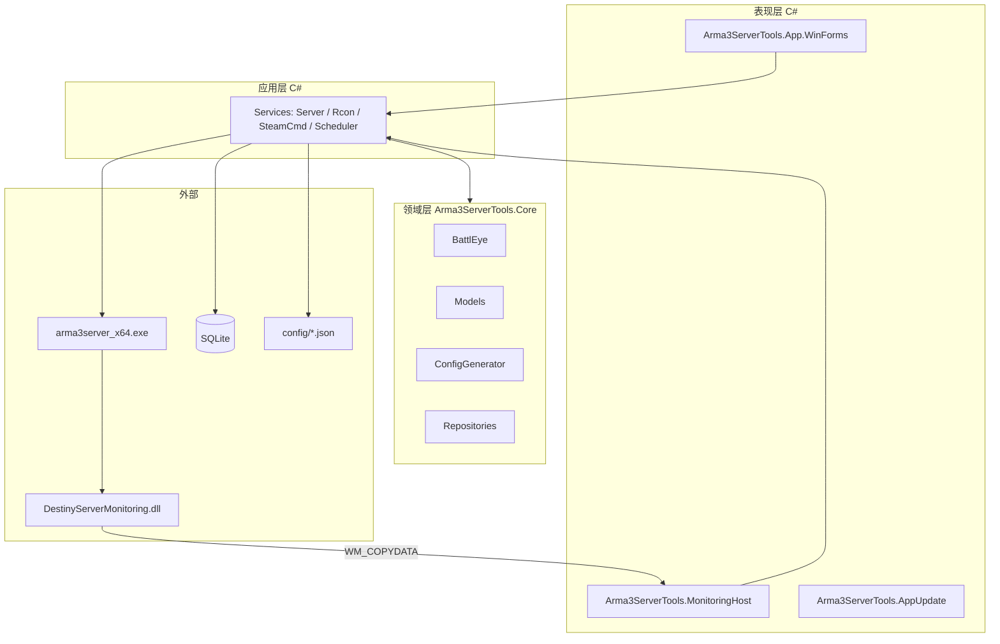

# Arma3 开服工具 — 纯 C# 技术栈改造方案

> 文档版本：1.3  
> 更新日期：2026-05-22  
> 状态：草案 / 实施参考

面向目标：**去掉 DevExpress、以 Apache 2.0 开源发布、保留并扩展现有能力、逻辑与 UI 分离**。  
UI 首版采用 **标准 WinForms（C#）**；可选二期用 **Blazor Server（仍全 C#）** 做 Web 管理，共用同一 Core。

---

## 一、改造目标与非目标

### 目标

| 目标 | 说明 |
|------|------|
| 开源可构建 | 克隆仓库后仅需 VS + .NET，**无需 DevExpress** |
| 逻辑可测、可扩展 | 新功能主要改 Core + 服务接口，少碰 UI |
| 保留原作者信息 | `NOTICE` / `README` 保留 Blue、七龙及原项目链接 |
| 功能不倒退 | 分阶段交付；v0.1 允许统计图表等延后 |

### 非目标（首阶段不做）

- 界面与现版 DevExpress 像素级一致
- 升级到 .NET 8（可放在阶段 6）
- 一次性删掉旧 `a3` 工程（保留至新 UI 稳定）

---

## 二、背景与约束

### DevExpress 与分发

- **30 天试用**不得用于创建可分发应用，不得再分发 DevExpress 文件（见 [Universal EULA §1.4](https://www.devexpress.com/support/eulas/universal.xml)）。
- **免费开源发布**必须移除全部 `DevExpress.*` 依赖。

### 技术选型结论（开发速度）

| 方案 | 首版速度 | 开源 | 说明 |
|------|----------|------|------|
| **Core + 标准 WinForms** | 最快 | ✅ | 与现有工程模型一致，推荐 |
| Core + Blazor Server | 较慢 | ✅ | 全 C#，适合二期远程/手机管理 |
| 就地替换 DevExpress 控件 | 短期快 | ⚠️ | 不利于长期维护，不推荐 |

---

## 三、目标架构



### 依赖规则（强制）

- **Core**：不引用 `System.Windows.Forms`、`DevExpress`、ASP.NET。
- **App / MonitoringHost**：只引用 Core（及 Application 若单独建库）+ 自身 UI。
- **BattlEye**：整体迁入 Core；命名空间可保留 `BytexDigital.BattlEye.Rcon` 或改为 `Arma3ServerTools.BattlEye`。

---

## 四、解决方案目录结构

```
arma3-server-tool/
├── LICENSE
├── NOTICE
├── README.md
├── docs/
│   ├── refactoring-plan.md    # 本文档
│   └── architecture.md        # 实施后可补充 API 说明
├── src/
│   ├── Arma3ServerTools.Core/           # 类库 net48
│   ├── Arma3ServerTools.Application/    # 可选：应用服务编排 net48
│   ├── Arma3ServerTools.App.WinForms/   # 新主程序 WinExe net48
│   ├── Arma3ServerTools.MonitoringHost/ # 隐藏窗体 WM_COPYDATA net48
│   ├── Arma3ServerTools.AppUpdate/      # 升级器（阶段 8 / P4 最低，去 DevExpress）
│   └── DestinyServerMonitoring/         # RVExtension DLL
├── sql/                                 # destiny_*.sql
├── extension/                           # steamcmd.exe（文档说明，可不提交）
├── legacy/
│   └── a3/                              # 原工程参考，逐步废弃
└── Arma3ServerTools.sln                 # 新解决方案（逐步替代 a3.sln）
```

**TFM**：阶段 1～4 在 **.NET Framework 4.8** 上完成；**阶段 7** 迁移至 **.NET 10 LTS**；**阶段 5** 首版开源 Release 以 **net10** 为基线（详见 [docs/net10-migration-plan.md](net10-migration-plan.md)）。

---

## 五、Core 模块迁移清单

### 5.1 直接迁入 Core

| 源路径 | 目标 | 改动要点 |
|--------|------|----------|
| `a3/BattlEye/**` | `Core/BattlEye/` | 无或极少改动 |
| `a3/Entity/**` | `Core/Models/` | 删除 `FluentDesignForm.SaveInfoTip` 等 UI 引用 |
| `a3/Tools/CfgTool.cs` | `Core/Config/` | `XtraMessageBox` → `ConfigException` 或 `Result<T>` |
| `a3/Tools/StartManagementTools.cs` | `Core/Process/` | 注入 `IServerContext`，去掉静态 `DefaultConfig` |
| `a3/Tools/FileTools.cs` | `Core/IO/` | JSON 配置读写 |
| `a3/Tools/MissionsTool.cs` | `Core/Missions/` | |
| `a3/Tools/RegularMatchTool.cs` | `Core/Mods/` | 工坊 ID/HTML 解析 |
| `a3/Tools/IPv4Tools.cs` | `Core/Net/` | |
| `a3/Tools/JsonConversionTool.cs` | `Core/` | |
| `a3/Tools/MachineCodeTool.cs` | `Core/` | 按需保留 |
| `a3/Tools/Security.cs` | `Core/` | |
| `a3/TaskJob/ServerRestartManagementJob.cs` | `Core/Scheduling/` | 依赖 `IServerProcessService` |

### 5.2 拆分迁入（逻辑 Core / UI App）

| 源 | Core | App |
|----|------|-----|
| `Tools/SteamcmdTools.cs` | `SteamCmdRunner` | SteamCMD 配置对话框 |
| `Tools/MonitoringServiceSqliteUtils.cs` | SQL 写入（去 Charts） | 图表展示 |
| `Config/SqliteUtils.cs` | `PlayerDatabase` | 错误提示 |
| `Config/DefaultConfig.cs` | `ServerRegistry` + 服务 | 当前 `ServerId` |

### 5.3 表现层或独立宿主

| 源 | 去向 |
|----|------|
| `FluentDesignForm`、`Modules/**`、`Dialog/**` | `legacy/a3` 参考；`App.WinForms` 新实现 |
| `Window/ProcessCommunication.cs` | `MonitoringHost` |
| `Window/ServerStatisticsManagement.cs` | v0.2+ 或简化表格 |
| `AppUpdate` | 去 DevExpress 的标准 Form（**P4 最低**，见阶段 8） |
| `DestinyServerMonitoring` | 保持，构建 DLL 随文档分发 |
| `Steamcmdtools/` | **不维护**，逻辑并入 Core |

---

## 六、应用层服务接口（C# 契约）

UI 只调用服务，不直接操作静态全局状态。

```csharp
// 配置
public interface IServerConfigService {
    IReadOnlyList<ServerListItem> List();
    ArmaServerConfig Get(string serverUuid);
    void Save(ArmaServerConfig config);
    void Delete(string serverUuid);
    ArmaServerConfig Create(string name, string serverDir);
}

// 进程
public interface IServerProcessService {
    OperationResult Start(string serverUuid);
    OperationResult Stop(string serverUuid);
    ServerRunState GetState(string serverUuid);
    void StartHeadlessClient(string serverUuid);
}

// 配置文件落地
public interface IGameConfigWriter {
    OperationResult WriteAll(ArmaServerConfig config);
}

// RCon
public interface IRconService : IAsyncDisposable {
    Task ConnectAsync(string host, int port, string password, CancellationToken ct);
    Task<IReadOnlyList<Player>> GetPlayersAsync();
    Task KickAsync(int playerId, string reason);
}

// 定时任务
public interface ISchedulerService {
    void SyncJobs(string serverUuid, IDictionary<string, CronEntity> crons);
}

// SteamCMD
public interface ISteamCmdService {
    OperationResult InstallDedicatedServer(string installDir);
    OperationResult UpdateWorkshopMods(IEnumerable<ulong> modIds);
}

// 监控
public interface IMonitoringIngestService {
    void Ingest(string rawMessage);
}

public sealed class OperationResult {
    public bool Success { get; init; }
    public string Message { get; init; }
}
```

### 取代 DefaultConfig

- 使用 `IServerContext`：`CurrentServerUuid` + `Get(uuid)`。
- 启动时 `ServerConfigRepository.LoadAll()` 加载 `config/*.json`。
- 保存走 `IServerConfigService.Save()`；UI 订阅 `ServerSaved` 更新状态栏。

---

## 七、WinForms 新 UI 页面规划

| 优先级 | 页面 | 对应旧模块 | v0.1 |
|--------|------|------------|------|
| P0 | MainForm + 导航 | FluentDesignForm | ✅ |
| P0 | 服务器列表 | IndexUserControl | ✅ |
| P0 | 启停 / 状态 | IndexUserControl | ✅ |
| P1 | 基本设置 | BasicSettingUserControl | ✅ |
| P1 | 网络 | NetworkSettingsUserControl | ✅ |
| P1 | 模组 | ModSettingsUserControl | 可简化 |
| P2 | 任务 / 难度 / 性能 / 日志 / 安全 | 各 Module | 迭代 |
| P2 | 封禁 / RCon | BansUserControl + BE | 迭代 |
| P2 | 定时任务 | AddTaskDialog + Cron | 迭代 |
| P3 | 快速向导 | QuickConfigurationWizard | 延后 |
| P3 | 统计图表 | ServerStatisticsManagement | 延后或 LiveCharts2 |
| P3 | 关于 | AboutUsControl | 简单版 |

### 主窗体布局（标准控件）

- 左：`ListBox` / `DataGridView` 服务器列表
- 右：`Panel` 动态加载 `UserControl`
- 底：`StatusStrip`（保存时间、当前服）
- 顶：`MenuStrip`（新建、SteamCMD、设置）

---

## 八、分阶段实施计划

> **当前实施顺序（阶段 4 完成后）**：**阶段 7**（net10 迁移）→ **阶段 5**（开源 Release v1.0）→ 阶段 6（可选 Web）→ 阶段 8（AppUpdate backlog）

### 阶段 0：准备（1～2 天）

- [x] 添加 `LICENSE`（**Apache 2.0**，与原作者许可一致）+ `NOTICE` 原作者
- [x] `.gitignore`：`bin/`、`obj/`、`packages/`、`.vs/`
- [x] 新建 `src/` 与 `Arma3ServerTools.sln`
- [x] 本文档与 `docs/architecture.md` 维护

### 阶段 1：Core 骨架（3～5 天）

- [x] 创建 `Arma3ServerTools.Core`（net48）
- [x] 迁移 `BattlEye`、`Models`（原 Entity）
- [x] `OperationResult`、`ConfigException`
- [x] `CfgTool` → `GameConfigWriter`（无 MessageBox）
- [x] `ServerConfigRepository`（`config/{uuid}.json`）

**验收**：Core 单独编译，无 WinForms / DevExpress 引用。 ✅（2026-05-22 `dotnet build Arma3ServerTools.sln -c Release` 通过）

### 阶段 2：应用服务（3～5 天）

- [x] `ServerProcessService`
- [x] `SchedulerService`（Quartz）
- [x] `SteamCmdRunner` → `SteamCmdService`
- [x] `MonitoringIngestService` + SQLite
- [x] `RconService` 封装

**验收**：可加载配置、写 cfg、进程启停（测试环境）。 ✅（2026-05-22 单元测试 14/14 通过）

### 阶段 3：WinForms MVP（1～2 周）

- [x] `Arma3ServerTools.App.WinForms`
- [x] MainForm + 列表 + 基本设置 + 启停
- [x] `MonitoringHost`（WM_COPYDATA）
- [x] 中文路径检查等业务规则迁移

**验收**：英文路径下完整开服最小流程。 ✅（2026-05-22 `dotnet build` + 单元测试 14/14 通过；输出含 `Arma3ServerTools.exe` + `MonitoringHost.exe`）

### 阶段 4：功能对齐（2～4 周）

- [x] 各设置页（基本/网络/安全/性能/日志/难度/模组/任务）
- [x] SteamCMD 配置、安装专用服务器、模组扫描/下载/勾选（含 steamcmdTools + WM_COPYDATA 备用下载、Steam API 确认）
- [x] RCon 管理（连接、玩家列表、踢人、封禁、公告、任务、锁定/解锁、同步玩家库）
- [x] 统计 Tab（玩家/物体统计查询、清理、InitPlayerOnlineInfo）
- [x] 监控异步入库（`QueuedMonitoringIngestService`）
- [x] 玩家库 `destiny_players.db`（`PlayerDatabaseRepository` + `PlayerDirectoryService`）
- [x] IPv4 校验、调度器退出 `StopAsync`、`DetectRestart` 接口化
- [x] Cron 定时任务 UI + 调度同步
- [x] 封禁（本地 + 多 URL 联合列表拉取/合并 + `bans.json` 管理）
- [x] `a3/` 标记 deprecated（见 `a3/DEPRECATED.md`）

**验收**：主要设置页可编辑保存；SteamCMD/模组/RCon/封禁/Cron/统计/玩家库可用。 ✅（2026-05-22 build + 自动化测试 **52/52** 通过，xUnit 跳过 **0**）

**自动化测试**（无需真实 Arma3 / SteamCMD）：

```powershell
powershell -ExecutionPolicy Bypass -File scripts/run-automated-tests.ps1
# 或
dotnet test Arma3ServerTools.sln -c Release
```

> **易混淆**：`dotnet test` 过程中 MSBuild 可能打印「正在跳过目标」——那是**增量编译**跳过未改动的编译步骤，**不是** xUnit 跳过测试用例。当前全部 `[Fact]` 均会执行，跳过数应为 **0**。

覆盖：配置读写、写 cfg、启停管道、AES/`data.json`、封禁、模组扫描/Bikey、SteamCMD 路径解析、监控入库/查询/异步入库、玩家库同步、RCon 未连接守卫、IPv4 校验等。  
**无自动化覆盖**（需人工或集成环境）：WinForms UI、真实 BattlEye RCon 协议、Steam 登录与 Workshop 下载、MonitoringHost WM_COPYDATA 联调。

### 阶段 7：.NET 10 LTS 迁移（7～11 天，**Release 之前**，详见 [net10-migration-plan.md](net10-migration-plan.md)）

**前置：** 阶段 4 验收通过 + 阶段 A 仓库清理。

**包评估摘要（§3）：** P0 换 `Microsoft.Data.Sqlite`；P1 移除 `Nito.AsyncEx`、`HttpWebRequest`→`HttpClient`、升级 Quartz/System.Management；P2 可选 Newtonsoft→STJ。

- [ ] 7.0 准备（SDK 10、net48 快照 tag、基准测试）
- [ ] 7.1 Core + Core.Tests → `net10.0-windows`（含 Nito 移除）
- [ ] 7.2 Application + `Microsoft.Data.Sqlite` 替换 + HttpClient
- [ ] 7.3 WinForms + MonitoringHost
- [ ] 7.4 steamcmdTools + 发布策略（框架依赖 / 自包含）
- [ ] 7.5 CI 与文档更新

**验收**：`dotnet test` 全绿；英文路径冒烟通过；无 net48 / Stub SQLite / Nito.AsyncEx 依赖。

### 阶段 5：开源发布（3～5 天，**阶段 7 完成后**）

**前置：** 阶段 7.5 迁移 DoD 达成。

- [ ] Release 基于 **net10**；不含 DevExpress DLL
- [ ] README：构建说明、**.NET 10 Desktop Runtime** 或 self-contained 包说明、`extension/steamcmd` 说明
- [ ] （可选）暂附旧 `AppUpdate/`（net472）或文档说明手动更新；不要求新版 AppUpdate
- [ ] 可选：GitHub Actions（SDK 10.x + `dotnet test`）
- [ ] 打 tag `v1.0`（或项目约定版本号）

**验收**：Release 包在目标环境可启动；CI 绿；文档与 net10 TFM 一致。

### 阶段 6（可选）：C# Web

- [ ] `Arma3ServerTools.Host` + Blazor Server
- [ ] 共用 Application 服务层
- [ ] MonitoringHost 不变

### 阶段 8（最低优先级 backlog）：AppUpdate

> 排在阶段 5 Release、7b、阶段 6 之后；**不阻塞**首版 Release。详见 [net10-migration-plan.md §7.6](net10-migration-plan.md)。

- [ ] 去 DevExpress 的标准 WinForms 升级器
- [ ] net10 重写 `src/Arma3ServerTools.AppUpdate`（原 7.6）
- [ ] 主程序更新入口接线；废弃根目录 `AppUpdate/`

---

## 九、DevExpress 清除检查表

- [ ] 删除所有 `DevExpress.*` 引用
- [ ] 删除 `Properties/licenses.licx`
- [ ] `XtraMessageBox` → `MessageBox` 或 `OperationResult`
- [ ] `GridControl` → `DataGridView`
- [ ] `LayoutControl` → `TableLayoutPanel` / 锚定
- [ ] `FluentDesignForm` → `Form` + 侧栏
- [ ] `SplashScreenManager` → 简单启动窗体
- [ ] `XtraCharts` → 延后或 LiveCharts2（MIT）
- [ ] 发布前：除 `legacy/` 外无 `DevExpress` 字符串

---

## 十、风险与对策

| 风险 | 对策 |
|------|------|
| Designer 迁移漏字段 | 每页对照旧 Module checklist |
| 漏改 DefaultConfig | 禁止新代码引用；CI grep |
| 路径不一致 | 统一 `IAppPaths`（工具根、config、sql） |
| 监控 DLL 找不到窗口 | 窗口标题/类名配置化 |
| 许可与商标 | README 免责声明；不包含游戏本体 |

---

## 十一、里程碑（单人 + 协作开发参考）

| 里程碑 | 内容 | 约计 |
|--------|------|------|
| M1 | Core 编译 + 配置读写 | 第 1 周 | ✅ |
| M2 | 启停 + 写 cfg + MonitoringHost | 第 2 周 | ✅ 进程启停 + 监控入库（Application 层） |
| M3 | WinForms MVP 可开服 | 第 3 周 | ✅ |
| M4 | 主要设置页 + RCon + SteamCMD/模组/封禁 | 第 4～6 周 | ✅ |
| M5 | net10 迁移（阶段 7） | 第 7～8 周 | |
| M6 | 开源 Release v1.0（net10） | 第 8～9 周 | |

---

## 十二、首批实施顺序

1. 建 `src/Arma3ServerTools.Core`，迁入 `BattlEye` + `Models`
2. 实现 `ServerConfigRepository` + `GameConfigWriter`
3. 建 `App.WinForms`：MainForm + 列表 + 启停
4. 建 `MonitoringHost`
5. 按 P1/P2 迭代设置页

---

## 十三、相关链接

- 原项目主页：https://destiny.cool/s/arma3-tool
- 原作者：Blue、七龙（见根目录 `README.md`）
- DevExpress Universal EULA：https://www.devexpress.com/support/eulas/universal.xml

---

## 修订记录

| 版本 | 日期 | 说明 |
|------|------|------|
| 1.0 | 2026-05-22 | 初版：纯 C# Core + WinForms 改造方案 |
| 1.1 | 2026-05-22 | 许可定为 Apache 2.0（与原作者一致） |
| 1.2 | 2026-05-22 | 阶段 0/1 完成：Core 骨架可独立编译 |
| 1.6 | 2026-05-22 | 迁移 steamcmdTools + WM_COPYDATA 备用下载、Steam Workshop API 确认对话框 |
| 1.7 | 2026-05-22 | AppUpdate 迁至阶段 8（P4 最低）；自阶段 4/5/7 主线路径移除 |
| 1.8 | 2026-05-22 | 实施顺序改为阶段 7 → 阶段 5；首版 Release 基于 net10 |
